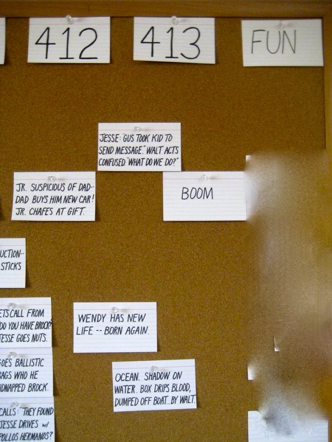
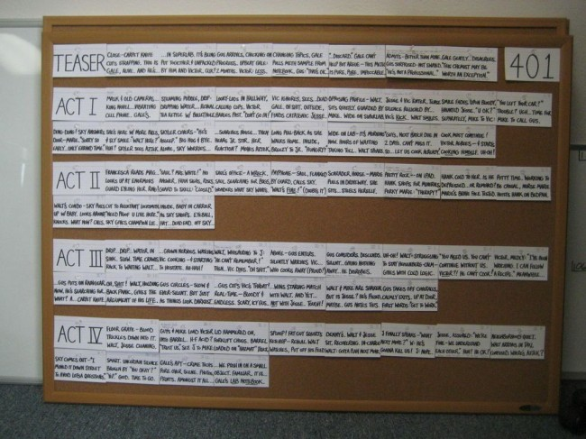
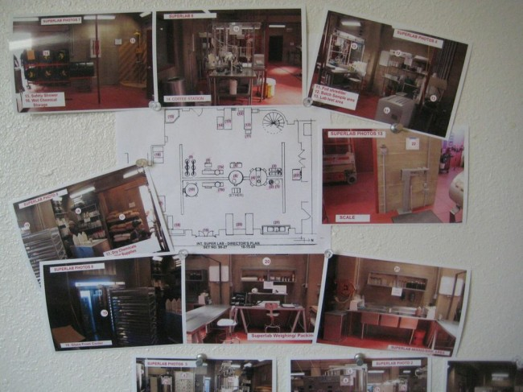

Title: Les coulisses de l'écriture de Breaking Bad
Date: 2013-09-02 19:14 
Author: Quack1
Category: Writing
Tags: Série, Breaking Bad, Écriture, Technique d'écriture, scénario
Slug: breaking_bad_writing_room
Summary: Plongée photographique au coeur de la salle d'écriture de la série _Breaking Bad_

Le site [Warming Glow](http://www.uproxx.com/tv/) a eu la chance de pouvoir rentrer dans la pièce où les scénaristes de _[Breaking Bad](http://www.allocine.fr/series/ficheserie_gen_cserie=3517.html)_ écrivent la série. Ceci a donné [un très bon article](http://www.uproxx.com/tv/2013/08/breaking-bad-writers-room-photos/) qui nous en apprend un peu plus sur les techniques utilisées lors de l'écriture.

En particuler, on y découvre qu'ils notent toutes leurs idées et points clés sur des petits papiers (à la manière des post-it de [Scrum](https://fr.wikipedia.org/wiki/Scrum_(méthode))), qui sont ensuite regroupés par épisodes et punaisés sur un grand tableau en liège. 

Au moment de la rédaction pure, tous ces petits papiers sont mis les uns à la suite des autres, ce qui donne une sorte de _[storyboard](https://fr.wikipedia.org/wiki/storyboard)_ de l'épisode (voir [image](#img_2)).

Pour également mieux s'imprégner des lieux, ils disposent des plans exacts et de photos des décors utilisés par la série (voir la [dernière image](#img_3) plus bas), comme [spoiler] le labo de meth sous la laverie, ou des plans d'Albuquerque.

J'ai repris ici quelques images, mais le mieux est quand même d'[aller lire l'article complet!](http://www.uproxx.com/tv/2013/08/breaking-bad-writers-room-photos/) :)

&nbsp;

&nbsp;

