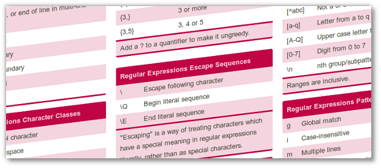

Title: Cheatography : Des cheatsheets en pagaille!
Date: 2013-05-02 16:23
Author: Quack1
Category: Geek
Slug: cheatsheets_en_pagaille
Tags: Cheatsheet, Aide, Dev, Astuces, planet-libre, Regex
Summary: Cheatography : Annuaire en ligne de partage de cheatsheets diverses.

&nbsp;

Article court aujourd'hui pour vous présenter [un site](http://www.cheatography.com/ "Cheatography") qui regroupe de nombreuses _cheatsheets_ dans de nombreux sujets. Bien sûr, il y en a sur l'informatique, mais le site propose aussi des _sheets_ dans les catégories "Vie de tous les jours", "Voyage, culture" et "Hobbies, Jeux".

Le petit plus, c'est que vous pouvez aussi partager vos propres feuilles sur le site!

En vrac, certaines que j'ai sélectionnées en rapport avec l'informatique : 

- [Expression Régulières](http://www.cheatography.com/davechild/cheat-sheets/regular-expressions/ "Cheatography - Regex")
- [Langage C](http://www.cheatography.com/pmg/cheat-sheets/c/ "Cheatography - Langage C")
- [Python](http://www.cheatography.com/davechild/cheat-sheets/python/ "Cheatography - Python")
- [Git & SVN](http://www.cheatography.com/ezk/cheat-sheets/git-svn-for-beginners/ "Cheatography - Git & SVN")
- [Screen](http://www.cheatography.com/gissehel/cheat-sheets/screen/ "Cheatography - Screen")
- [Ligne de Commande Linux](http://www.cheatography.com/davechild/cheat-sheets/linux-command-line/ "Cheatography - Linux")
- [MySQL](http://www.cheatography.com/davechild/cheat-sheets/mysql/ "Cheatography - MySQL")
- [Wikipedia](http://www.cheatography.com/davechild/cheat-sheets/wikipedia/ "Cheatography - Wikipedia")
- [Gmail](http://www.cheatography.com/fredv/cheat-sheets/gmail-cheat-sheet/ "Cheatography - GMail")

Et plein d'autres [ici](http://www.cheatography.com/office-business-and-technology/ "Cheatography - Informatique").
