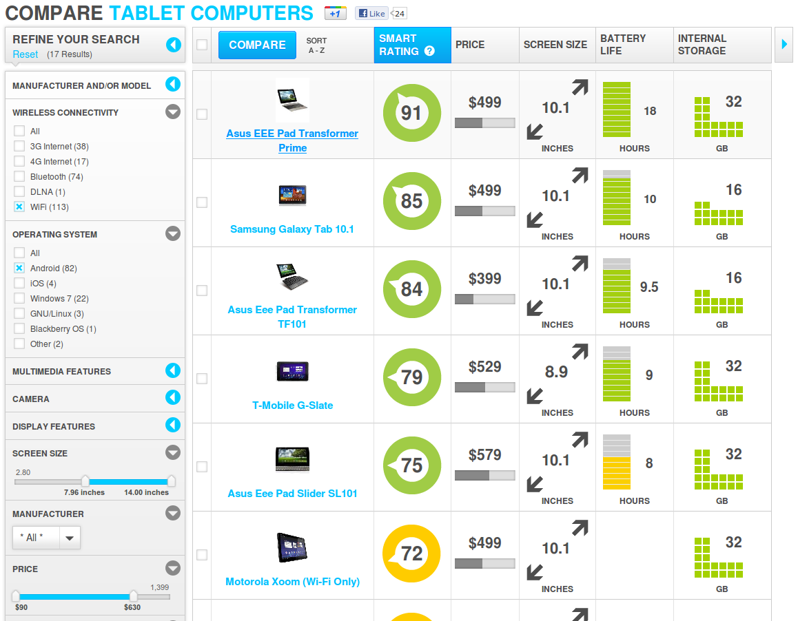
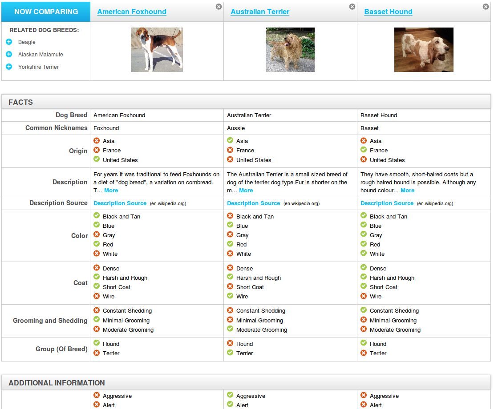

Title: Comparer rapidement (presque) n'importe quoi
Date: 2012-02-20 17:37
Author: Quack1
Category: Geek
Tags: comparer, find the best, n'importe quoi

Vous voulez partir en vacances au ski, acheter une voiture ou une
tablette tactile, ou bien adopter un chien pour les enfants, mais vous
hésitez encore ? J'ai le site parfait pour vous!!

**[FindTheBest][]**
va comparer pour vous, suivant de nombreux critères, les articles que
vous aurez choisis, dans plein (mais alors plein plein plein) de
catégories. Les voici :

-   Finances et business
-   Éducation
-   High-tech
-   Santé
-   Maison
-   Véhicules
-   Logiciels
-   Sports et distractions
-   Voyages

Et ensuite, dans toutes ses catégories, on a encore des dizaines
d'autres catégories. Donc, en gros, vous pouvez comparer un peu tout ce
que vous voulez!!

Vous pouvez aussi faire une recherche, en utilisant les critères utilisé
par la comparaison par le site.

Donc, pour faire simple, si vous cherchez un truc, sans arriver à vous
décider, allez sur ce site!!!!!

 

Voici donc quelques exemples pour vous donner un avant goût!!

 

*Je peux chercher une tablette Android, avec Wifi, entre 8 " et 14", et
à moins de 630\$....*

*.... Ou comparer trois races de chiens pour savoir laquelle me
conviendra le mieux à cause des enfants...*

*.... Ou encore, chercher un chirurgien plastique qui pratique les
augmentations mammaires....*

 

... Bref, allez y faire un tour, ça peut toujours servir!!

  [FindTheBest]: http://www.findthebest.com/ "http://www.findthebest.com/"
