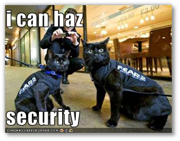
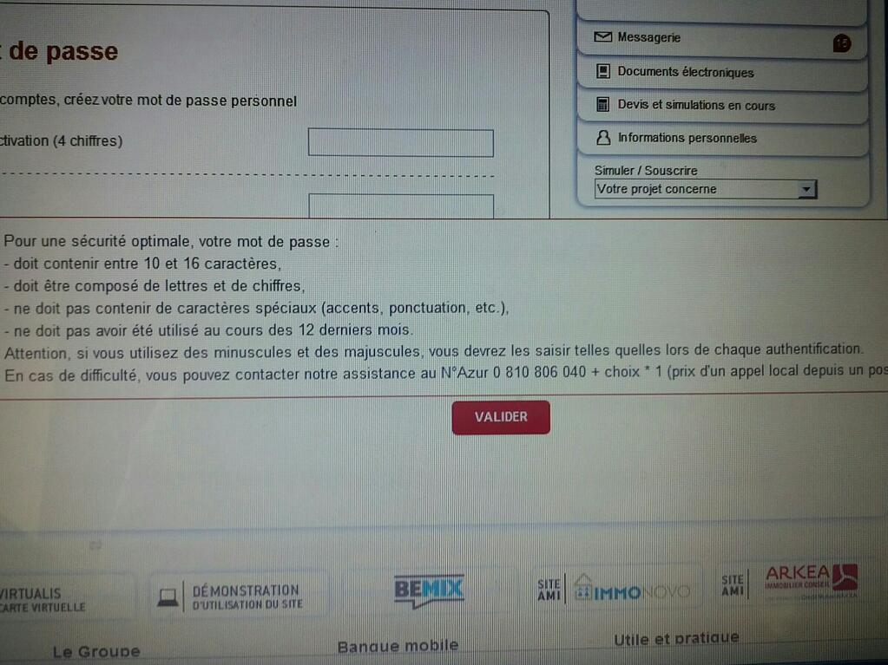

Title: Credit Mutuel security fail (poke @Credit_Mut )
Date: 2013-05-10 19:00
Author: Quack1
Category: Securité
Slug: credit_mutuel_security_fail
Tags: Sécurité, Password, Mot de Passe, Fail, Credit Mutuel
Summary: Récents fails de sécurité du Crédit Mutuel vis à vis des mots de passe.

&nbsp;

J'ai récemment eu quelques déboires en matière de sécurité avec ma banque. Je les ai toutes (je crois...) [tweetées](https://twitter.com/_Quack1 "Twitter @_Quack1"), mais pour ceux qui ne me suivent pas, je vais faire un résumé ici.

# De la sensibilisation des conseillers

En début d'année, j'avais oublié le mot de passe me permettant d'accéder à l'application Web de gestion de mon compte en banque. Résultat, après 3 mauvais essais, blocage du bouzin. Le seul moyen de récupérer un mot de passe est de contacter son conseiller banquaire, qui peut débloquer l'accès et vous faire parvenir un nouveau mot de passe par courrier.

La procédure "normale" qui est censée se produire quand j'appelle ma banque pour obtenir un nouveau mot de passe est celle-ci : 

- Mon conseiller, un agent d'accueil, bref, la personne que j'ai au téléphone ouvre mon dossier ;
- Cette personne tente de m'authentifier en me posant des questions "personnelles" donc je serais le "seul" à connaitre la réponse : ma date de naissance, mon adresse, le nombre de comptes que j'ai en cours chez eux, etc...
- Une fois cette authentification effectuée, la personne débloque mon compte et, si je le souhaite, m'envoie un nouveau mot de passe par courrier en lettre recommandée à l'adresse indiquée dans mon dossier.

J'ai malheureusement rencontré plusieurs problèmes de sécurité en demandant à mon conseiller de m'envoyer un nouveau mot de passe : 

<blockquote class="twitter-tweet" lang="fr">
J'adore mon banquier. Je l'appelle pour qu'il débloque l'accès Web à mon cpte. Il le fait sans rien me demander de plus que mon nom. <a href="https://twitter.com/search/%23fail">#fail</a>
&mdash; Qu@ck1 (@_Quack1) <a href="https://twitter.com/_Quack1/status/329980404582977536">2 mai 2013</a></blockquote>
<blockquote class="twitter-tweet" lang="fr">
La dernière fois,il a voulu m'envoyer un nouveau mot de passe à l'autre bout de la France en lettre simple tjs sans demander + d'infos <a href="https://twitter.com/search/%23fail">#fail</a>
&mdash; Qu@ck1 (@_Quack1) <a href="https://twitter.com/_Quack1/status/329980674205442049">2 mai 2013</a></blockquote>
<blockquote class="twitter-tweet" lang="fr">
J'avais dû lui préciser que si, malgré tout, c'était un peu mieux en recommandé…
&mdash; Qu@ck1 (@_Quack1) <a href="https://twitter.com/_Quack1/status/329980750487236608">2 mai 2013</a></blockquote>

- Celui-ci ne me pose **aucune** question sur moi. Je lui donne mon nom/prénom, et ça lui suffit
- Je lui demande de m'envoyer mon nouveau mot de passe à une nouvelle adresse, située à 600km de mon adresse connue dans la banque : "no soucy"
- Il a voulu m'envoyer mon courrier en lettre simple
- Enfin, le mot de passe reçue ne fait que 4 chiffres, et est écrit à 2cm de mon identifiant sur le courrier reçu.

Niveau sécu, on est pas ultra conforme aux bonnes pratiques...

# Des restrictions sur un mot de passe ?

L'autre gros #[fail](/tags/Fail.html) m'est apparu lorsque mon père a été invité a se créer un nouveau mot de passe sur le site de cette même banque.

Si on jette un oeil aux exigences sur le mot de passe choisi on voit ceci :

- Au moins 10 caractères : Bon
- 16 caractères max : **WHAT ?** C'est vrai que le prix du Go est tellement élevé qu'il faut limiter la taille de la BDD
- Obligation d'utiliser lettres et chiffres : Bon, pas mal, ça permet d'augmenter un peu la sécurité du truc...
- Pas de caractères spéciaux : Encore mieux. Autant j'arrive à trouver une raison pour la limite max sur la taille du mot de passe, là désolé, mais je vois pas...
- Ne pas avoir utilisé au cours des 12 derniers mois : Là aussi, je trouve cette règle plutôt bonne.

Donc si on récapitule, sur les 5 règles présentées, 2 sont totalement connes et ruinent toute la sécurité mise en place par les autres règles.

# Mais pourquoi ? Et comment résoudre ça ?

Je ne peux pas blamer ici que mon conseiller. Il a une petit cinquantaine d'années, travaille dans une agence de province, dans une petite ville de Bretagne. Il n'a sûrement jamais été confronté à la sécurité informatique, et encore moins formé à celle-ci.

C'est plutôt la banque elle-même qui devrait se poser des questions, et former ses informaticiens aux problématiques de sécurité informatique.

Il est totalement con d'imposer des restrictions comme celles présentées plus haut aux mots de passe. J'ai vraiment du mal à comprendre pourquoi ils ont choisi de mettre ça en place.

Concernant mon banquier, comme je le disais plus haut, ce n'est pas (que) de sa faute. Il n'a jamais été formé à la sécu, et je pense que pour lui la sécurité à son niveau est inutile pour deux raisons : 

1. Le système et les applications sont sécurisées, pas la peine de prendre trop de précautions
2. Personne ne cherchera à attaquer le compte en banque d'un étudiant qui a son compte en banque dans une agence perdue de Bretagne

Malheureusement, la sécurité commence ici, et il est important pour tous, et en particulier les institutions qui manipulent des données sensibles et des sommes d'argent (plus ou moins) importantes, comme les banques, de former tous leurs collaborateurs, quelque soit leur niveau, afin de garantir une sécurité et une qualité de service optimale.

On ne pourra malheureusement pas changer ça en 1 semaine, mais quelques séries de _training_ et de sensibilisation à la sécurité informatique (et dans ce cas présent, au social engineering) sont à envisager très fortement.

_Notons quand même que la toute première fois que j'ai appelé ma banque pour obtenir un nouveau mot de passe, la jeune fille que j'ai eu au téléphone a respecté la procédure de renouvellement de mot de passe à la lettre. Tout n'est donc pas perdu, les jeunes générations semblent plus au courant des bonnes pratiques!_

# EDIT du 14/05/2013 :

**Le CM du Credit Mutuel ([@Credit_Mut](https://twitter.com/Credit_Mut)) est plutôt efficace, et après une relance de ma part m'a demander de les contacter par mail plutôt que via Twitter. Je leur ai donc envoyé un petit mail au sujet de leur sécurité, plus qu'à attendre leur réponse que je posterais ici quand elle m'arrivera!**

[Source de l'image](http://i.chzbgr.com/completestore/2009/2/11/128788721115436058.jpg)

[Dernière image par @securityshell](https://twitter.com/securityshell/status/328928436087308288/photo/1)