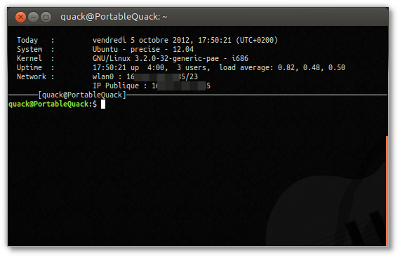

Title: Customisation de mon .bashrc
Date: 2012-10-05 16:52
Author: Quack1
Category: Linux
Tags: Bash, Customisation, Linux, planet-libre, planet-ubuntu
Summary: Modifications à apporter à son fichier .bashrc pour afficher quelques informations sur l'état de votre machine.

Petit article pour me souvenir d'un bout de script que j'ai placé à la
fin de mon fichier .bashrc, qui me permet d'obtenir 2-3 infos sur mon
système au lancement d'un terminal. Au menu, la date, l'heure, la
version de l'OS, du noyau, l'uptime et les adresses IP de mes interfaces
réseaux. Au final, j'obtiens ce rendu :

Première chose que j'ajoute au fichier de configuration de Bash : la
définition de quelques couleurs. En effet, ça ne se voit pas beaucoup
ici, mais les infos affichées en haut du terminal sont en gris clair. Je
peux donc choisir des couleurs différentes pour chaque machine, et
pouvoir différencier mes terminaux rapidement.

<pre>
black='e[0;30m'
blue='e[0;34m'
green='e[0;32m'
cyan='e[0;36m'
red='e[0;31m'
purple='e[0;35m'
brown='e[0;33m'
lightgray='e[0;37m'
darkgray='e[1;30m'
lightblue='e[1;34m'
lightgreen='e[1;32m'
lightcyan='e[1;36m'
lightred='e[1;31m'
lightpurple='e[1;35m'
yellow='e[1;33m'
white='e[1;37m'
nc='e[0m'
</pre>

Ensuite, j'ai les deux parties les plus longues du script (au passage,
si quelqu'un voit comment faire mieux, je suis preneur :-) ). J'affiche
sous les infos mon login et le nom de ma machine, le tout entouré d'une
ligne. Le problème, c'est que je peux avoir plusieurs tailles de
fenêtres, et les traits seraient trop petits ou trop grands. J'ai donc
une boucle pour n'afficher que le bon nombre de tirets :

<pre>
theUser="───────[$USER@$HOSTNAME]"
lgth=$(($COLUMNS-${#theUser}))
i=0
while [[ $i -lt $lgth ]]; do
  theUser="$theUser─"
  (( i += 1 ))
done
</pre>

Ensuite, je cherche à récupérer les adresses IP de mes interfaces
réseaux. Problème : certaines interfaces n'ont pas d'adresses IP
définies, et d'autres sont inutilisées (adresses virtuelles de
communication avec mes VM). J'ai donc un bout de script un peu moche
avec une boucle et des conditions...

<pre>
ip_adress=""
for if in eth0 wlan0
do
    ip=$(ip addr show dev $if | grep "inet "| awk '{print $2}')
    if [[ "$ip" ]] 
    then
	if [[ -z "$ip_adress" ]]
	then
	    ip_adress="        ${lightgray}$if : $ip" 
	else
	    ip_adress="$ip_adressn                    ${lightgray}$if : $ip"
	fi
    fi
done
ip=$(curl -s 'http://canihazip.com/s/')
if="IP Publique"
if [[ "$ip" ]]
    then
        if [[ -z "$ip_adress" ]]
        then
            ip_adress="        ${lightgray}$if : $ip"
        else
            ip_adress="$ip_adressn                    ${lightgray}$if : $ip"
        fi
    fi
if [[ -n ip_adress ]]
then
    ip_adress="  Network : $ip_adress"
fi
</pre>

*Notez que les espaces permettent juste d'avoir un affichage "propre"
des valeurs.*

Enfin, je ne fais qu'afficher les données dans mon terminal avec de la
substitution de commandes pour afficher les infos utiles :

<pre>
clear
echo -e ""
echo -e "  ${lightgray}Today   :         `date`"
echo -e "  ${lightgray}System  :         `lsb_release -i | cut -f 2` - `lsb_release -c | cut -f 2` - `lsb_release
 -r | cut -f 2`"
echo -e "  ${lightgray}Kernel  :         `uname -o` `uname -r` - `uname -m`"
echo -e "  ${lightgray}Uptime  :        `uptime`"
echo -e "$ip_adress"
echo -e "${lightgray}$theUser"
</pre>

Tous ces petits bouts de codes ne ralentissent pas (pas trop)
l'ouverture de mon terminal, seul le curl et les boucles sont un peu
lents, mais ce n'est pas trop gênant!

Tout ceci est basé sur un script écrit par [@VictorBersy][].

[@VictorBersy]: https://twitter.com/VictorBersy/status/233125380423311361 "@VictorBersy"
