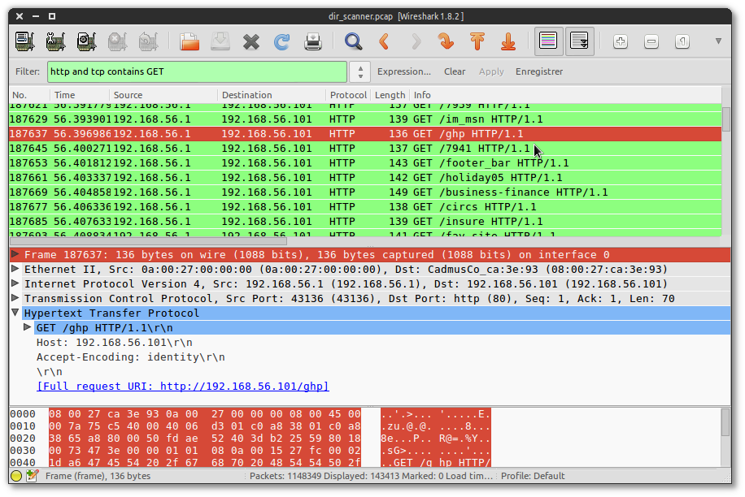
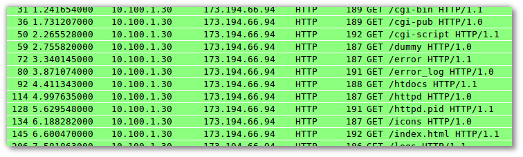
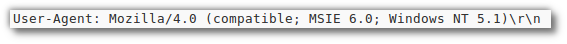
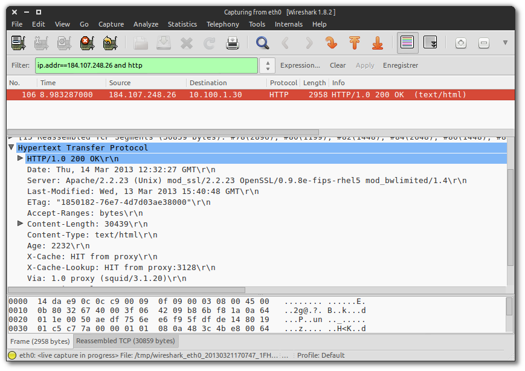
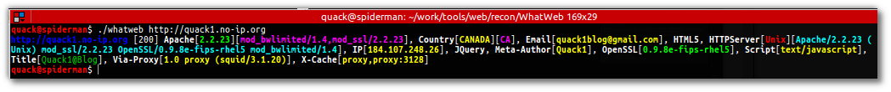
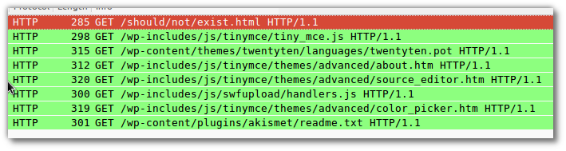

Title: Web Scanners : Fonctionnement et Détection
Date: 2013-03-15 16:27
Author: Quack1
Category: Securité
Slug: ids_web_scanners
Tags: Snort, IDS, Stage, Détection d'Intrusion, Web, Scanners, Pentest, Blind Elephant, Dirb, DirBuster, SkipFish, WhatWeb, WebSploit, Job
Summary: Fonctionnement et Détection de Scanners Web simples et massivement utilisés.

Je vous présentais la semaine dernière l'[IDS Snort](snort_overview.html), et vous expliquait dans l'introduction de ce billet que j'étais en train de préparer des scénarios d'attaques utilisées lors d'audits. Et bien voici le premier billet présentant des règles permettant de détecter quelques outils utilisés pour réaliser des scans Web.

&nbsp;

L'analyse de ces outils vise à déployer de nouvelles règles et signatures dans [Snort](http://snort.org), un **NIDS**. Il faut donc analyser le traffic réseau des outils afin de trouver des moyens de les identifier. Pour ceci, [Wireshark](http://www.wireshark.org) _is your friend©_. Il va lire la totalité des flux transitant sur une (ou plusieurs) de vos interfaces réseau, et va décoder les protocoles, afin de vous afficher les requêtes envoyées et les réponses reçues de façon claire et détaillée. De plus, son système de filtres (basé sur celui de `tcpdump`) permet d'y voir un peu mieux. Mais je n'en dirais pas plus, de [nombreux tutos](http://blog.nicolargo.com/2011/05/capturer-et-analyser-un-trafic-reseau-avec-wireshark.html) et [cours](https://www.wireshark.org/docs/wsug_html_chunked/) sont disponibles [sur Internet](https://www.google.fr/search?hl=fr&q=tuto%20wireshark).

Je vais vous présenter dans cet article 4 outils et demi. Je ne détaillerais pas leur installation, ni la façon de les utiliser, puisque généralement ces 2 étapes sont très bien décrites sur les sites des outils. Et, au pire, [RTFM](https://lh5.ggpht.com/_5YF7KQZuZS0/S-lsUz8YIwI/AAAAAAAAClc/MPxUJ9qnTc8/If-you-want-them-to-rtfm%5B3%5D.jpg?imgmax=800). Je détaillerais cependant leur fonctionnement, en particulier au travers de leur empreinte sur le réseau, ce qui nous permettra d'écrire nos règles Snort par la suite.

Les outils que nous verrons dans l'article sont : 

- [dirb](http://dirb.sourceforge.net/) : Lister les répertoires et fichiers accessibles sur un serveur web ;
- [DirBuster](https://www.owasp.org/index.php/Category:OWASP_DirBuster_Project) : Comme dirb, mais avec un enrobage en Java tout autour, et quelques options de configuration en plus ;
- [WhatWeb](https://github.com/urbanadventurer/WhatWeb) : Permet d'obtenir des informations sur le serveur Web, le CMS, etc... ;
- [BlindElephant](http://blindelephant.sourceforge.net/) : Identification de la version d'un CMS et certains de ses plugins (pour Wordpress et Drupal) ;
- [WebSploit](http://sourceforge.net/p/websploit/wiki/Home/) : Framework d'évaluation et d'_exploit_ d'application Web, semblable au célèbre [Metasploit](http://www.metasploit.com/download/) ;

# Premier outil : **dirb**.

[Dirb](http://dirb.sourceforge.net/) est sûrement le plus simple de tous ceux dont je vais parler ici. Tout ce qu'il effectue, c'est un [Brute-Force](https://fr.wikipedia.org/wiki/Recherche_par_force_brute) d'une URL afin de trouver les répertoires et fichiers distants accessibles. Pour cela, au lieu d'effectuer une rechercher exhaustive "débile" (c'est à dire tester 'a', 'aa', 'aaa', ...), il utilise des listes de mots définies qui correspondent à des noms de fichiers que l'on trouve généralement dans des CMS, ainsi que des mots usuels des principales langues (anglais, espagnol, français).

De façon plus technique, cela consiste à une suite de requêtes HTTP `GET`.

Même si le lancement de cet outil est très visible dans Wireshark, nous n'avons pas de moyen permettant d'identifier avec précision cet outil. La technique "habituelle" dans ce genre de cas est de filtrer via le _User-Agent_ envoyé dans les requêtes HTTP. Cette technique a un gros inconvénient : il est **très** simple modifier le User-Agent, et donc de _bypasser_ les filtrer de détection. Dirb propose même une option pour le faire, et utilise par défaut un User-Agent de Mozilla.

La seule chose qu'il sera possible de détecter ici sera donc la quantité de requêtes effectuées par le scanner en un cours instant. Avec une connexion internet tout à fait normale, on peut envoyer plusieurs requêtes par seconde sans problème. C'est donc sur ce critère que nous allons écrire notre **première** règle Snort!

	:::snort
	alert tcp any any -> $SERV_IP_TEST $HTTP_PORTS_TEST (msg:"AUDIT_TOOLS File/Directory Brute-Force. Possible tools : Dirb";content:"GET";detection_filter:track by_src, count 5, seconds 1;flow:established,to_server;sid:99900040;)

Cette règle se déclenchera si elle trouve : 

- `detection_filter:track by_src, count 5, seconds 1;` Au moins 5 paquets en 1 seconde qui proviennent de la même adresse source ;
- `flow:established,to_server;` En ne prenant en compte que les paquets allant vers le serveur et provenant de sessions établies.
- Les autres options n'ont pas d'importance dans la détection.

# Un dirb v2 : DirBuster

Je ne vous ferais pas l'affront de vous présenter le _click-o-drome_ qu'est [DirBuster](https://www.owasp.org/index.php/Category:OWASP_DirBuster_Project). Enfin, si, un peu quand même ;-) 

DirBuster fait (à peu de choses près) la même chose que Dirb, sauf que : 

- Il est écrit un Java et dispose d'une interface graphique ;
- Au lieu d'envoyer des requêtes `GET`, il envoie des `HEAD` ou un mix des deux ;
- Il utilise par défaut 10 threads, et donc peut envoyer beaucoup plus de requêtes en même temps.

Dans les faits, ce sont les principales qu'il a avec Dirb. La détection pourra donc se faire de la même façon que Dirb.

Par contre, histoire de changer un peu, je vais vous donner une deuxième méthode qui permet de le détecter. Cette méthode se base sur le fait qu'avant de lancer son Brute-Force, DirBuster effectue une requête sur une ressource qu'il est (quasiment) sûr de ne pas trouver sur le serveur. J'appelle cette requête le _fail-case test_. Ensuite, il Brute-Force le serveur distant en utilisant un User-Agent qui lui est propre. Nous allons utiliser ces deux informations pour détecter DirBuster.

_Mais, tu nous as pas dit que la détection par_ User-Agent _n'était pas une donnée sur laquelle on pouvait se baser ?!? O\_o._

Si, je vous l'ai dit. Mais je vais l'utiliser ici pour deux raisons : 

1. Il est peut probable que quelqu'un la modifie. Et quand bien même il le ferait, la règle écrite pour Dirb détecterait aussi DirBuster ;
2. J'ai envie de vous montrer un petit _trick_, et pour cela j'ai besoin de ce critère!

Ici, je vais donc écrire 2 règles. La première va détecter le _fail-case test_, la seconde va détecter une succession de requêtes avec l'User-Agent de DirBuster. 

	:::snort
	alert tcp any any -> $SERV_IP_TEST $HTTP_PORTS_TEST (msg:"AUDIT_TOOLS [NO ALERT] DirBuster \"Fail Case\" test";uricontent:"/thereIsNoWayThat-You-CanBeThere/";flowbits:set,dirbuster.failcase;flowbits:noalert;sid:99900010;)
	alert tcp any any -> $SERV_IP_TEST $HTTP_PORTS_TEST (msg:"AUDIT_TOOLS DirBuster scan detected";content:"Dir";nocase;pcre:"/User-Agent\s*:\s*DirBuster/i";detection_filter:track by_src,count 5,seconds 1;flowbits:isset,dirbuster.failcase;sid:99900011;)

1. La première règle se déclenche si une URI contient `/thereIsNoWayThat-You-CanBeThere/` (le _fail-case_ de DirBuster). Dans ce cas-là, elle "allume" (pas trouvé de meilleure traduction...) un flag, nommé `dirbuster.failcase` (mot clé `flowbits`), et on lui demande de ne pas lever d'alerte `flowbits:noalert;`.
2. La seconde règle se déclenche lorsqu'un paquet contient une chaine de caractères qui _match_ [l'expression régulière](visualiser-graphiquement-vos-expressions-regulieres-en-ligne.html) suivante : `User-Agent\s*:\s*DirBuster/`. Attention, les regex dans Snort sont à saisir au format [pcre](http://www.pcre.org). Enfin, les derniers critères filtrent la quantité de paquets reçus (5 paquets en 1 seconde par adresse source), et ne se déclence **que si** le flag `dirbuster.failcase` a été placé auparavant.

On peut donc dans Snort écrire des règles qui se déclenche en chaîne, ou plus précisement, écrire des règles qui ne se déclenchent que si une(/des) autre(/s) règles ont déjà été déclenchées.

# What ?! Web ?! Nooon!! "WhatWeb" !

[WhatWeb](https://github.com/urbanadventurer/WhatWeb) est un outil assez intéressant lors des étapes de reconnaissance puisqu'il permet en quelques requêtes de récupérer énormément d'informations sur le serveur et l'application distants, notamment en récupérant des informations dans les _headers_ HTTP, ainsi que dans le contenu de la page ou les informations DNS.

De plus, son affichage est assez intéressant et simple à lire. 

Seul inconvénient d'un point de vue détection : l'outil fait très très peu de requêtes. Sur les 4 niveaux d'agression disponibles, seul le quatrième fait plus de 5 requêtes. La seule solution ici pour le détecter est de chercher son User-Agent dans les paquets HTTP. Étant donné qu'il effectue très peu de requêtes, on n'ajoute pas de filtre sur la quantité, pour ne pas rater de scan.

	:::snort
	alert tcp any any -> $SERV_IP_TEST $HTTP_PORTS_TEST (msg:"AUDIT TOOLS WhatWeb [User-Agent]";content:"WhatWeb";pcre:"/User-Agent:.*WhatWeb\/\d+.\d+/i";sid:99900020;)

# Un éléphant (aveugle) dans un magasin de porcelaine

Le quatrième outil présenté dans cet article s'appelle [BlindElephant](http://blindelephant.sourceforge.net/) et qui permet d'obtenir la version du CMS utilisé, ainsi que les versions de certains des plugins dans le cas d'un CMS Wordpress ou Drupal.

Comme WhatWeb, il effectue très peu de requêtes, puisque généralement le code source Html des pages Web contient de nombreuses informations sur la partie serveur et les technologies utilisées. Il calcule ensuite le hash de certains fichiers statiques et compare ces hashs avec des valeurs connues. 

La détection se fait donc un peu au pif, en détectant le _fail case_ de BlindElephant.

	:::snort
	alert tcp any any -> $SERV_IP_TEST $HTTP_PORTS_TEST (msg:"AUDIT_TOOLS [NO ALERT] BlindElephant \"Fail Case\" test";content:"GET ";nocase;content:"/should/not/exist.html";flow:established, to_server;sid:99900000;)

# Websploit : Framework d'audit Web

Enfin, je vais finir avec _WebSploit_, un Framework dédié (ou pas) à l'audit Web, dont le mode de fonctionnement est très similaire à Metasploit.

Personnellement, ce n'est pas un logiciel que je recommenderais. Il est codé avec les pieds, pas mis à jour depuis près d'un an, et le code n'est pas dispo dans les dépôts Git et SVN de l'auteur. J'ai fait quelques modifs dans le code que j'ai téléchargé avec l'archive, si vous êtes interessés je pourrais le déposer dans un repo GitHub.

Par contre, il peut quand même être utile et, étant dispo dans BackTrack, il doit être utilisé par pas mal de _kiddies_ en mal de hack.

J'ai donc retenu 2 modules qui étaient en phase avec les outils précédents : `web/pma` et `web/apache_users`. Le premier permet de trouver le répertoire dans lequel se trouve PhpMyAdmin, en effectuant un Brute-Force avec un dictionnaire contenant une soixantaine de noms possibles, dérivés de 'PhpMyAdmin' et 'pma'. Le second détecte si des utilisateurs du systèmes utilisent les répertoires `public_html` proposés par Apache. Ce système, où chaque utilisateur du système possède un répertoire dans son _home_ qui lui permet de gérer ses pages Web, a la particularité de rendre tous ces dossiers accessibles depuis Internet via une URL de la forme `/~<user_name>/`. Ce module de WebSploit va donc brute-forcer le serveur Web avec un dictionnaire composé de nombreux usernames possibles, en les préfixant tous de '~'.

Quand je vous parlais d'un programme codé avec les pieds, je sous-entendais ceci : le développeur n'a pas dû tester son programme. Normalement, une requête Web c'est de la forme `GET /<un nom de ressource>`. Si on fait un brute-force, on remplace `<un nom de ressource>` par chacune des valeurs possibles. Si la ressource existe, on reçoit un code HTTP 200, si elle n'existe pas, on reçoit un code d'erreur 404 (rassurez vous, plein d'autres cas sont possibles). Sauf qu'ici, le gentil codeur a oublié le premier slash. Du coup, on envoit des dizaines de requêtes `GET toto`, `GET tata`, etc... Et donc, on se mange à chaque fois des erreurs `400 Bad Request`.

La solution, si vous souhaitez utiliser cet outil, c'est de rajouter un slash dans le code source des fichiers qui vont bien. Pour ces deux modules, dans les fichiers `./modules/apache_users.py` et `./modules/pma.py`, il faut remplacer la ligne : 

	:::python
	conn.request("GET",path)

par : 

	:::python
	conn.request("GET","/%s"%path)

Comme je vous le disais, les attaques sont ici basées sur le Brute-Force. On va donc détecter 2 brute-force. Je ne vous détaille pas les règles, normalement après les précédentes vous devriez pouvoir y arriver ;-)

	:::snort
	# Brute-Force /phpmyadmin : websploit (web/pma)
	alert tcp any any -> $SERV_IP_TEST $HTTP_PORTS_TEST (msg:"AUDIT TOOLS Brute-Force to find PhpMyAdmin. Possible tools : WebSploit Module 'web/pma'";content:"GET";nocase;offset:0;depth:3;content:"/phpmyadmin";nocase;detection_filter:track by_src,count 50,seconds 5;sid:99900041;)
	# Brute-Force apache public_html user directory : websploit (web/apache_users)
	alert tcp any any -> $SERV_IP_TEST $HTTP_PORTS_TEST (msg:"AUDIT TOOLS Brute-Force to find Apache users 'public_html' directory. Possible tools : WebSploit Module 'web/apache_users'";content:"GET /~";nocase;detection_filter:track by_src,count 50,seconds 5;sid:99900042;)
	alert tcp any any -> $SERV_IP_TEST $HTTP_PORTS_TEST (msg:"AUDIT TOOLS Brute-Force to find Apache users 'public_html' directory. Possible tools : WebSploit Module 'web/apache_users'";content:"GET ~";nocase;detection_filter:track by_src,count 50,seconds 5;sid:99900043;)

# En conclusion

Conclusion très courte, mais qui reflète bien la réalité. Toutes les signatures que j'ai présenté ici sont très simplement contournables. Elles se basent principalement sur 2 choses : l'_User-Agent_ et le nombre de requêtes par seconde. Très souvent, les outils proposent nativement des options pour modifier ces valeurs, et s'ils ne le font pas, c'est, en gros, 1 ligne de code à rajouter.

Malgré tout, elles nous permette d'obtenir une bonne vision des choses qui se passent sur notre réseau, et surtout si des gens essayent de s'amuser avec. Et de plus, elles sont spécifiques à des outils, et à leur façon d'exploiter des failles. Une phrase tirée de la doc de snort et que je trouve très juste est : 

> Catch the Vulnerability, Not the Exploit

Il est plus judicieux de pouvoir détecter tous les outils exploitant une faille, plutôt que seulement la façon qu'a un outil de l'exploiter. Une technique générale est certes plus complexe à mettre en oeuvre, mais elle sera beaucoup plus efficace. 

Enfin, n'oubliez pas qu'un bon auditeur (ou un bon attaquant, c'est selon) arrivera à passer vos IDS et les protections que vous avez mis en place. Il ne faut donc pas compter que sur des règles Snort pour assurer votre sécurité!

&nbsp;

_Au fait, si vous avez des règles Snort, des outils que vous utilisez souvent en audit, ou des techniques de détection en stock, n'hésitez pas à les partager!_