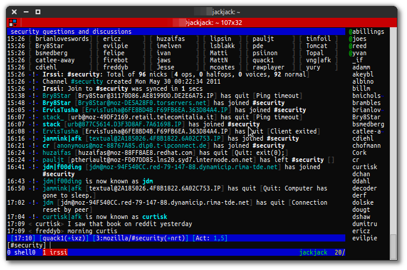

Title: Installation et configuration d'un client IRC (irssi) sur un serveur distant
Date: 2013-04-16 14:12
Author: Quack1
Category: Linux
Tags: IRC, Irssi, Screen, Serveur, planet-libre, planet-ubuntu
Summary: Tutorial pour installer et configurer le client IRC irssi et un multiplexer de terminal screen.

Quand on discute sur [IRC](http://fr.wikipedia.org/irc), il peut etre assez énervant de devoir quitter une conversation, puis la reprendre quelques minutes plus tard, et de ne pas pouvoir accéder à ce qui s'est dit pendant nos moments d'absence. Pour combler ce problème, la solution est de lancer un client IRC sur un serveur, et de s'y connecter pour avoir accès au conversation.

Personnellement, j'utilise [irssi]() comme client IRC. C'est un client en mode texte mais très pratique, très fonctionnel, et supportant les plugins. Pour le mettre en place sur un serveur distant, il y a 2 solutions : 

1. Lancer irssi en lui ajoutant un plugin proxy, puis lancer un client en local qui va se connecter au proxy irssi plutôt qu'au serveur IRC ;
2. Se connecter en ssh sur une machine distante, y lancer irssi dans un [screen](https://www.gnu.org/software/screen/), puis simplement sortir du screen avant de se déconnecter. Ainsi irssi sera toujours actif dans le screen même lorsque l'on sera déconnecté.

Personnellement, j'ai utilisé la deuxième solution que je vais vous présenter ici!

_La configuration que je vous présente tourne sur mon Raspberry Pi (modèle B), à côté d'un serveur nginx et deux 2-3 autres conneries, et tout est parfaitement stable et réactif!_

# Screen

Screen est "est un utilitaire permettant d'ouvrir plusieurs terminaux dans une même console, de passer de l'un à l'autre et de les récupérer plus tard. Ceci explique sa désignation de "multiplexeur de terminaux". " (_[Doc Ubuntu-fr](http://doc.ubuntu-fr.org/screen)_)

Il s'installe en une ligne de commande : 

	:::bash
	root@jackjack # apt-get install screen

Puis il se lance via 

	:::bash
	root@jackjack # screen

On arrive donc dans le premier "onglet" de screen. Très rapidement quelques raccourcis clavier : 

- Pour rajouter un _screen_ : Ctrl-a c (Ctrl-a puis 'c') ;
- Pour naviguer entre les _screens_ : Ctrl-a Ctrl-a ;
- Pour afficher la liste des _screens_ ouverts : Ctrl-a " ;

Plus d'infos dans [la doc Ubuntu](http://doc.ubuntu-fr.org/screen). 

Et normalement vous avez de quoi vous débrouiller avec ça! J'ai juste rajouté quelques lignes de configuration pour modifier certains comportements.

Pour cela, on récupère le fichier de configuration par défaut, puis on le modifie : 

	:::bash
	root@jackjack # cp /etc/screenrc ~/.screenrc
	root@jackjack # nano ~/.screenrc

À la fin, j'y rajoute ceci : 

	:::bash
	# (1)
	screen -t shell0 0
	screen -t irssi 1 irssi
	# (2)
	hardstatus on
	hardstatus alwayslastline
	hardstatus string "%{.bW}%-w%{.rW}%n %t%{-}%+w %=%{..G} %H %{..Y} %d/%m/%y %c "
	# (3)
	vbell off
	autodetach on
	# (4)
	nonblock on
	bindkey -k F2 next
	# (5)
	defscrollback 35000
	termcapinfo xterm|xterms|xs|rxvt ti@:te@

1. On crée au lancement de screen 2 shells : Le premier "vide", et le deuxième dans lequel on lancera la commande `irssi`. Notez que quand la commande se termine/s'arrête, le _screen_ correspondant est fermé.
2. On affiche une barre de statut bleur en bas de l'écran, contenant la liste des _screens_ ouverts, le nom de l'hôte ainsi que la date et l'heure. Le _screen_ en cours sera en rouge.
3. On supprime le clignotement de l'écran (essayez sans ces lignes de conf, vous verrez la différence ;-) ).
4. En cas de déconnexion intempestive, on se détache automatiquement des _screens_, et on rajoute un raccourci clavier (F12, et non F2) qui permettra d'accéder plus rapidement au _screen_ suivant.
5. Enfin, on rajoute un buffer de 35000 lignes pour contenir un historique du contenu des _screens_ plus grand (pour pouvoir scroller dedans) et on active le _scroll_ à la souris avec la dernière ligne.

# Irssi

[Irssi](http://www.irssi.org) est un client IRC en mode texte, offrant les mêmes fonctionnalités que n'importe quel client graphique. Comme pour screen, son installation nécessite une ligne : 

	:::bash
	root@jackjack # apt-get install irssi
	root@jackjack # screen

Pas de nouveautés dans son utilisation, il suffit de savoir utiliser [IRC](https://fr.wikipedia.org/wiki/Internet_Relay_Chat). Par contre, on modifie légèrement sa conf pour avoir quelque chose de plus agréable.

On [récupère un thème](http://www.irssi.org/themes) qui va bien, et on le place dans `~/.irssi/`, puis on le charge dans irssi par un :

	:::bash
	/set theme revolutionaryv2

Idem, on va [charger un script](http://scripts.irssi.org/) nommé 'nicklist.pl' permettant d'avoir à droite de l'écran la liste des personnes connectées au chan en cours. On le place dans `~/.irssi/scripts/` et dans `~/.irssi/scripts/autorun/` (le dernier permet de le charger automatiquement au démarrage).

On charge ce dernier script, on lui demande de s'afficher dans notre _screen_, et que cela soit aussi son mode par défaut : 
	
	:::bash
	/load nicklist.pl
	/nicklist screen
	/set nicklist_automode SCREEN

Enfin, je rajoute un serveur au fichier de configuration de irssi, situé à `.irssi/config`. Dans le partie "servers", je rajoute le serveur irc de Mozilla. La syntaxe est assez claire, on donne l'adresse du serveur, son nom pour y accéder plus facilement dans irssi, le port de connexion, puis on active le support de SSL. 

	:::bash
	servers = (....,
		{
			address = "irc.mozilla.org";
			chatnet = "mozilla";
			port = "6697";
			use_ssl = "yes";
			ssl_verify = "yes";
			ssl_capath = "/etc/ssl/certs";
		}
	);

On pourra ensuite s'y connecter dans irssi par : 

	:::bash
	/connect mozilla

Enfin, pour avoir une connexion automatique via le bot "NickServ", on rajoute ces lignes dans la section "chatnets" : 
	
	:::bash
	chatnets = {....
	mozilla = {
	    type = "IRC";
	    nick = "quack1";
	    username = "quack1";
	    realname = "quack1";
	    autosendcmd = "/msg NickServ identify <PASSWORD_TROP_COMPLIQUÉ>;wait 8000";
	};
	}

Donc ok, c'est pas top de mettre un password en clair dans un fichier texte, c'est même sacrément moisi, mais c'est pour l'instant le seul truc que j'ai trouvé pour avoir une connexion automatique au serveur. En même temps, c'est juste un chan IRC, mes partitions et mon /home sont chiffrés, bref, analyse de risque, #toussa #toussa... :-)

# Enfin

Enfin, tout est normalement configuré comme il se doit. En vous connectant en ssh sur votre serveur, faites un `screen -Rd` pour (`-R`) se réattacher à une session screen, ou en créer une nouvelle si aucune n'existe, et (`-d`) de détacher du _screen_ dans lequel vous êtes.

Si vous avez suivi la même configuration que moi, vous aurez un shell dans le premier _screen_ et irssi lancé dans le deuxième, prêt à se connecter à vos #chan favoris!

# Sources : 

[Doc de screen sur Ubuntu-fr [fr]](http://doc.ubuntu-fr.org/screen)

[Configuration de screen [fr]](http://www.windowslinux.net/ssh-screen)

[Activation de la roulette de la souris dans screen [en]](http://www.staldal.nu/tech/2009/01/11/how-to-use-mousewheel-in-gnu-screen/comment-page-1/#comment-380)