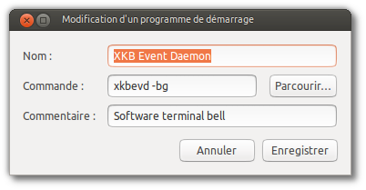

Title: Activate the audible notifications in a 'irssi-screen-ssh' configuration, or how to re-activate the system 'beep' on a GNU/Linux system.
Date: 2013-05-23 09:12
Author: Quack1
Category: Linux
Slug: linux_beep_terminal
Tags: Ubuntu, Linux, Beep, Terminal, en
Summary: Script to reactivate the system 'beep' on a GNU/Linux system, especially an Ubuntu.
Lang: en

&nbsp;

I presented some weeks ago in a previous post [my IRC configuration](|filename|/irssi-screen.md), composed by an `irssi` started on a remote `screen`. Then, I connect to that host through ssh, and I re-attach my `screen` session.

This configuration is perfect and I'm using it every day, but I still has a major issue : when I'm mentionned, I don't receive any notification, while my IRC client should normally 'beep'.

# Irssi - screen - Terminal

To activate notifications in `irssi`, it's verry simple, and this configuration is available quite everywhere on the Ternet (for example, [on the official doc](http://www.irssi.org/documentation/tips)).

	/set beep_when_window_active ON
	/set beep_when_away ON
	/set beep_msg_level MSGS NOTICES DCC DCCMSGS HILIGHT
	/set bell_beeps ON

For making `screen` activate the audio notifications, just do some `Ctrl-A Ctrl-G` until you see `Switched to Audible Bell` at the bottom of the `screen`.

Finally, we check our terminal is correctly configured to sens audible _beeps_.

- In Gnome-Terminal : _Edit_ --> _Profil Preferences_ --> Check _Terminal Bell_
- In Terminator : Right-Clic --> _Preferences_ --> _Profiles_ --> Choose your profile on the left, then --> _General_ --> Check _Audible beep_

Normaly, you should receive notifications when someone mentions you on IRC. If you want to test that your **local** system works fine, type `echo -e '\a'` into a shell. You should hear the defined "beep".

# And if that doesn't work

In my case, it didn't work. After many Google searchs, precisely about my `irssi/screen/ssh` configuration, I went to the `irssi` IRC channel on Freenode (#irssi@irc.freenode.net), and after some talking with some users (poke deadweasel, billnye, Death4Life), I searched a little more about system issues, and someone pointed out that since a last release of Ubuntu (we don't really know which one), the system beeps are deactivated from the kernel, and so you can't receive your IRC client notifications.

To reactivate the blacklisted kernel module, a simple `sudo modprobe pcspkr` should be enough (I didn't type the command, so I can't assure you it works).

This solution has a real drawback for me : the beeps don't pass through the soundcard, and so are not redirected in my headphones if they are plugged in. (Once again, feel free to notice me if I'm wrong). Except that for me, during my day work, I don't really want my laptop to beep every 5 minutes because I was mentioned on a chan, I prefer that it all go directly in my headphones.

So I searched a bit more and I felt down on that solution, where I actually redefine the behavior of the system when it has to execute the `Bell()` function.

To do that, you need to install the following package : 

	:::zsh
	╭────<quack@spiderman >───<  ~ >  
	╰───[18:09:57] $ sudo apt-get install vorbis-tools

And then you create a script : 

	:::zsh
	╭────<quack@spiderman >───<  ~ >  
	╰───[18:10:32] $ cat ~/.xkb/xkbevd.cf          
	soundDirectory="/usr/share/sounds/"
	soundCmd="ogg123 -q"
	Bell() "ubuntu/stereo/message-new-instant.ogg"

This means that when a system 'Beep' will be raised, the system will execute instead the following command :

	:::zsh
	ogg123 -q /usr/share/sounds/ubuntu/stereo/message-new-instant.ogg

If you want to personnalize the sound, you just have to modify the variables `soundDirectory` and the one located just after the `Bell()` in the code ;-)

Finally, I added a startup program to be launched when I connect into my system (I did that really simply, graphicaly in Ubuntu).

For the modifications to be effective without relogging the first time, launch :

	:::zsh
	xkbevd -bg

And then, you should receive 'beeps' since your Terminal sends an audible signal, and especially in `irssi` ! ;-D
