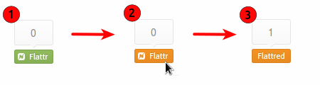

Title: Partage et rémunération de mes articles
Date: 2013-11-21 10:26
Author: Quack1
Category: Blog
Tags: Blog, Partage, Rémunération, Flattr, Creative-Commons
Slug: partage_et_remuneration
Summary: 

# Partage libre de mes articles

J'ai (_enfin_) mis un vrai logo des [Creative Commons](http://creativecommons.org/ "Creative Commons") sur le blog dans la barre latérale. Cela officialise le fait que la totalité du contenu de ce blog[1] est diffusé sous une licence libre [Creative Commons CC-BY-NC](http://creativecommons.org/licenses/by-nc/3.0/fr/ "Creative Commons - Attribution - Pas d’Utilisation Commerciale 3.0 France").

Cela signifie que vous pouvez faire ce que vous voulez de mes articles — donc les modifier, les partager, les imprimer, etc... — à quelques conditions :

- La clause **BY** implique que vous devez citer l'auteur et la source de l'article que vous utilisez (dans le cas présent, mon pseudo et l'URL de l'article) ;
- la clause **NC** implique que la réutilisation de mes articles ne peut se faire que de façon non commerciale.

Je pense que cette licence est un bon moyen de permettre à tout un chacun de réutiliser l'information que je partage sur ce blog, tout en étant dans un cadre légal autorisant et favorisant le partage.

J'ai également ajouté dans la _sidebar_ le logo SHARE, imaginé par Neil Jomunsi — qui a lancé [le projet Bradbury](http://writing.quack1.me/projet_bradbury.html "Projet Bradbury : 52 semaines ⇒ 52 nouvelles") — et Jérémie Gisserot. Ce logo a pour but d'indiquer au premier coup d’œil [que le contenu est diffusable « librement » [2]](http://actualitte.com/blog/projetbradbury/partage-share/ "Le partage n’est pas un dommage collatéral : c’est une finalité (Share)").

# Et si on essayait de rémunérer les créateurs ?

Je ne souhaite pas gagner ma vie avec ce blog. C'est pour moi un moyen de partager des contenus et informations que je juge intéressants et qui peuvent être utiles pour certains de mes lecteurs.

Comme je l'ai dit juste avant, je crois au partage de l'information, notamment grâce à l'utilisation de licences libres. Le corollaire d'une légalisation des échanges non-marchands est de permettre à chaque « consommateur » de contenu numérique libre de pouvoir rémunérer les créateurs de façon simple.

C'est pour cette raison que, à la manière de [Ploum](http://ploum.net/si-vous-testiez-le-web-payant/), j'ai décidé de rendre ce blog payant, tout en laissant à chacun le choix du montant qu'il souhaitait payer pour y avoir accès. 

Pour le moment, je pense que le plus simple est d'utiliser un système de micro-paiment qui est a été fait pour la rémunération des créateurs, j'ai nommé [Flattr](https://flattr.com/). Pas d'autre système de dons pour le moment, je verrais ça plus tard si ça intéresse certains lecteurs.

Flattr est un système très simple dont le fonctionnement et l'utilisation sont décrits [sur cette page](http://fr.openclassrooms.com/informatique/cours/le-systeme-de-micro-paiement-flattr).

En résumé, après vous être inscrit sur le site Flattr, vous définissez le montant que vous souhaitez donner tous les mois à des créateurs. Disons, 5€. Ensuite, vous recherchez des boutons comme celui-ci (j'en ai placé un en haut de chacun de mes articles) :

	

En cliquant dessus, vous arriverez sur le site de Flattr, sur lequel vous pouvez alors _Flattr_-er le contenu en cliquant sur le bouton « Flattr ». En fois que c'est fait, le bouton affiche que vous avez bien rémunéré le créateur de contenu.

	

Par contre, j'ai oublié de mentionner un point : comment choisir combien d'argent vous donnez pour chaque _Flattr_. Et bien, c'est impossible de le savoir au préalable. En fait, à la fin de chaque mois, le site Flattr compte le nombre de contenus que vous avez _Flattr_-é, et donne une part égale de la somme que vous avez fixé à chacun.

_Exemple_ : Vous aviez choisi de donner 5€ tous les mois, et vous avez _Flattr_-é 8 contenus au cours du mois de novembre. Début décembre, chaque « Flattr » recevra 5€/8 = 0,62€. Et si vous aviez choisi de rémunérer 3 de mes articles au cours du mois de novembre, je recevrais 3x0,62€ = 1,86€ en décembre !

Je ne peux que vous encourager à l'utiliser, non seulement pour me _Flattr_-er ;-) , mais aussi pour donner quelques pièces aux nombreux sites qui utilisent ce système aujourd'hui !

☠

Dans tous les cas, que vous me _Flattr_-iez un jour ou l'autre ou non, merci de venir me lire et partager mes articles ! 

☠

## Notes

[1] Sauf si une mention indique le contraire, dans le cas par exemple des médias que j'ai récupéré ailleurs, et pour lesquels la mention de la licence ou de l'auteur est incluse.

[2] Le logo SHARE indique que le contenu est partageable en l'état, donc comme s'il est publié sous licence [CC-BY-NC-ND](http://creativecommons.org/licenses/by-nc-nd/3.0/fr/ "Creative Commons - Attribution - Pas d’Utilisation Commerciale - Pas de dérivés 3.0 France"). Je pense que la BY-NC que j'utilise englobe la BY-NC-ND, donc je pense que le logo SHARE est compatible avec ce blog.