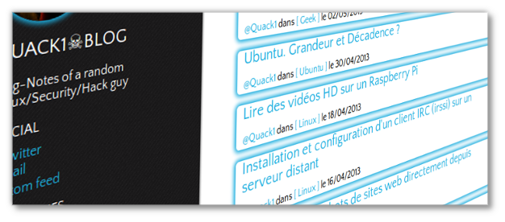

Title: Thème &laquo; Notebook &raquo; pour Pelican
Date: 2013-05-17 15:38
Author: Quack1
Category: Blog
Slug: pelican_notebook
Tags: Blog, Pelican, Notebook, Theme, planet-libre
Summary: Présentation du thème &laquo;Notebook&raquo;, développé pour le moteur de blog statique Pelican.

&nbsp;

Comme je vous l'expliquais dans mon article de [présentation de la v3 du blog](|filename|blog_v3.md), j'ai écrit un nouveau thème pour le moteur de blog statique [Pelican](http://blog.getpelican.com), utilisé pour propulser ce blog.

Je l'ai voulu simple, clair, épuré. Il est ainsi basé (et même honteusement copié) sur celui du [site de Paul Rouget](http://paulrouget.com/ 'Paul Rouget'), mais aussi sur le thème [Bootstrap2](https://github.com/quack1/pelican-themes/tree/master/bootstrap2 'Bootstrap2 Theme') disponible pour Pelican.

Si vous souhaitez vous aussi créer un nouveau thème, la documentation est plutôt bien fournie sur [le site du CMS](http://docs.getpelican.com/en/3.2/themes.html). La méthode que j'ai employée est plutôt simple. J'ai _forké_ le thème `simple` disponible par défaut avec toute installation de pelican (et accessible sur mon Linux dans `/usr/local/lib/python2.7/dist-packages/pelican/themes/simple`). Ensuite j'ai ouvert les sources d'un autre thème plus évolué pour voir grossièrement à quoi ressemblait le code, et j'ai modifié fichier par fichier jusqu'à obtenir le résultat souhaité.

Je ne vais pas m'attarder sur le développement d'un nouveau template Jinja (le moteur utilisé par Pelican), il y a assez de littérature à ce sujet sur le Net. Je vais plutôt ici expliquer comment l'utiliser.

Le thème est diffusé sous les termes de la [Nouvelle License BSD](http://opensource.org/licenses/BSD-3-Clause). Vous pouvez donc l'utiliser, le modifier, le redistribuer à votre guise!

&nbsp;

La première chose à faire est de récupérer les sources pour les placer dans votre répertoire local contenant vos thèmes. Celles-ci sont disponibles sur [github](https://github.com/quack1/notebook), vous pouvez donc, au choix, télécharger un zip ou cloner le dépôt.

Une fois ceci fait, il suffit de l'activer dans votre `pelicanconf.py` pour commencer à l'utiliser.

	:::zsh
	╭────<quack@spiderman >───<  ~/work/workspace/web/pelican/sample_project >  
	╰───[19:00:11] $ grep THEME pelicanconf.py
	THEME = "../themes/notebook"

Et normalement, ça marche!

Cependant, si vous souhaitez bénéficier de toutes les possibilités offertes par ce template, vous devez rajouter quelques informations au fichier de configuration.

# Plugins

Je supporte ici 2 plugins, parmi ceux proposés par Pelican. Si vous souhaitez que le thème soit compatible avec d'autres plugins, je vous encourage à faire la modification sur le thème puis à m'envoyer une Pull-Request sur github pour que j'ajoute vos modifications!

- Disqus. Le plugin de commentaires Disqus est supporté, et s'utilise comme pour tous les autres thèmes.

		:::zsh
		DISQUS_SITENAME = 'quack1blog'

- Google Analytics. Pour utiliser Google Analytics, comme pour Disqus, ajoutez simplement votre ID Google Analytics dans le `pelicanconf.py`

		:::zsh
		GOOGLE_ANALYTICS = 'UA-00000000-1'

# Nouvelles variables

J'ai ajouté quelques fonctionnalités qui collaient à l'utilisation que je voulais avoir du thème. Il y a donc quelques nouvelles variables accessibles via le fichier de conf : 

- Twitter : Pour configurer les liens de partage des posts sur Twitter, j'ai ajouté la variable `TWITTER_USERNAME`
- Avatar : L'avatar affiché dans la sidebar est défini par la variable `AVATAR`, qui doit contenir le chemin d'accès à l'image depuis la **racine** du site
- Digest : Le petit résumé situé sous l'avatar vient de la variable `SIDEBAR_DIGEST`, qui peut contenir du Html, CSS, Javascript, etc...
- Les deux bannières d'affiliation Mozilla de bas de page viennent de la variable `FIREFOX_BANNERS`. La variable est en fait un tableau à définir comme ceci : 

	FIREFOX_BANNERS = (('banner_id', 'path_to_the_image', u'alt_text'),
					('banner_id', 'path_to_the_image', u'alt_text'))

Pour une bannière "standard", les valeurs sont mappées comme ceci dans le code : 

	

`path_to_the_image` peut être le lien fourni par le site d'affiliation Mozilla lors de la création de la bannière, mais ça ne marche pas avec ma version de Firefox (Nightly 23). Bizarre, donc j'ai dû télécharger l'image pour la charger en local. Je chercherais la cause de ceci plus tard! ;-)

# Twitter/Facebook Card

Twitter propose un mécanisme de _Twitter Card_, permettant d'intégrer les pages Web plus joliment dans les clients Twitter. Facebook propose également un système similaire. Ces _cards_ passent par des tags situés dans les Header Html de la page. J'ai intégré ceci à mon thème, et voici comment les valeurs sont mappées : 

	:::Html
	<meta name="twitter:card" content="summary">
  <meta name="twitter:site" content="{{ TWITTER_USERNAME }}">
  <meta name="twitter:image" content="{{ SITEURL }}/{{ AVATAR }}">
	<meta name="twitter:creator" content="{{ TWITTER_USERNAME }}">
	<meta name="twitter:url" content="{{ SITEURL }}/{{ article.url }}">
	<meta name="twitter:title" content="{{ SITENAME }} ~ {{ article.title }}">
	<meta name="twitter:description" content="{{ article.summary }}">

	<!-- Facebook Meta Data -->
	<meta property="og:title" content="{{ SITENAME }} ~ {{ article.title }}" />
	<meta property="og:description" content="{{ article.summary }}" />
	<meta property="og:image" content="{{ AVATAR }}" />

La variable `article.summary` doit être définie dans chacun des articles au moyen de l'en-tête `Summary`. Si cette valeur ne l'est pas, les premiers `SUMMARY_MAX_LENGTH` mots de l'article seront utilisés (ce qui peut causer des erreurs dans le code Html suivant le début de votre article...)

# Icônes

Enfin, les icônes utilisées proviennent du projet Font-Awesome, et ont été colorisées par mes soins.

Font Awesome by Dave Gandy - http://fortawesome.github.com/Font-Awesome