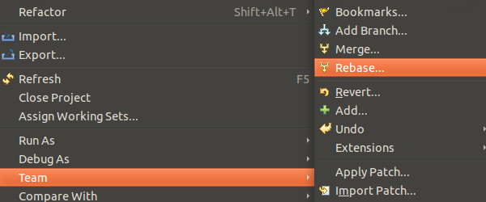
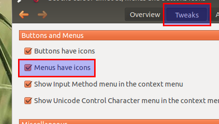

Title: Retrouver les icônes des menus sur Unity
Date: 2012-04-10 15:21
Author: Quack1
Category: Ubuntu
Tags: icones, menus, ubuntu, ubuntu tweak, unity, planet-libre
Summary: Afficher les icônes dans les menus déroulants et contextuels sur Ubuntu.

J'avais remarqué depuis que j'avais Unity que je n'avais plus les
petites icônes dans les menus du clic-droit. Je n'avais jamais vraiment
cherché comment les retrouver, jusqu'à aujourd'hui où j'ai décidé de
chercher un peu. Et j'ai trouvé la solution sur [askubuntu.com][] !

En fait, Unity semble désactiver par défaut l'affichage de ces icônes.
Pour les réactiver, on va utiliser l'utilitaire [Ubuntu Tweak][].

On va sur l'onglet **Tweaks**, puis **Miscellaneous**, et enfin, on
coche la case **Menus have icons**. J'ai aussi coché **Buttons have
icons**, comme ça on les rajoute partout ;-)

 

[Source][askubuntu.com]

  [askubuntu.com]: http://askubuntu.com/questions/96776/missing-icons-in-dropdown-menus-in-eclipse "http://askubuntu.com/questions/96776/missing-icons-in-dropdown-menus-in-eclipse"
  [Ubuntu Tweak]: http://doc.ubuntu-fr.org/ubuntu_tweak "http://doc.ubuntu-fr.org/ubuntu_tweak"
