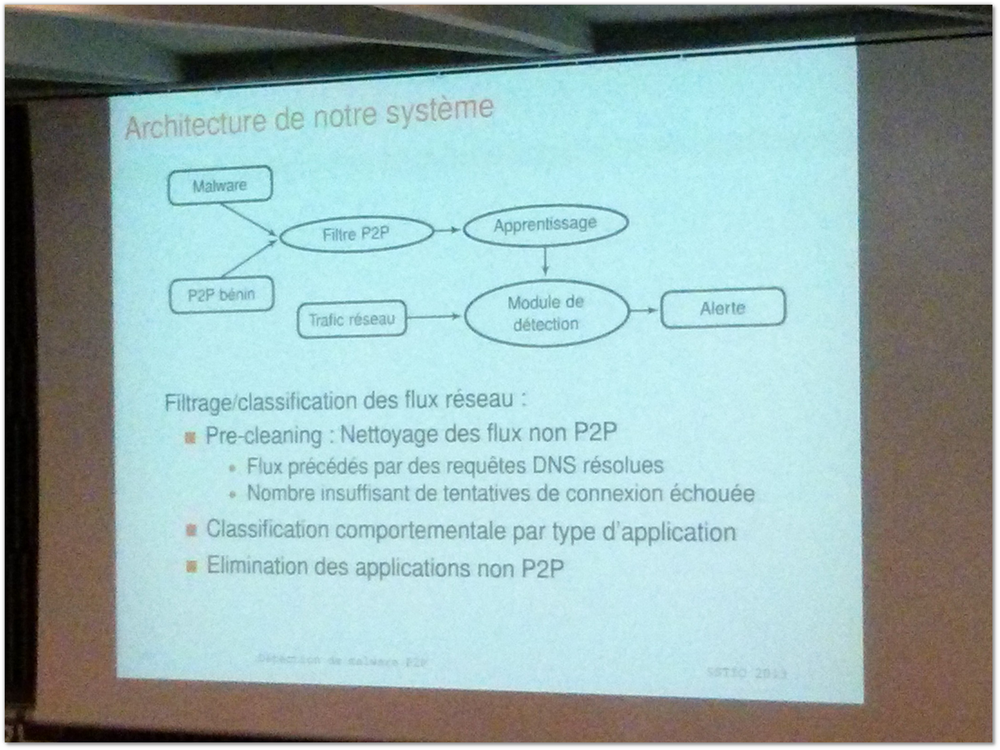

Title: SSTIC 2013 Jour #3 : Présentations courtes
Date: 2013-06-07 20:02
Author: Quack1
Category: Securité
Slug: sstic_2013_3_courtes
Tags: SSTIC, SSTIC 2013, Sécurité, planet-libre, planet-ubuntu, Job, Stage
Summary:  SSTIC 2013 Jour 3 : Présentations courtes
Lang: fr

Dernière journée, dernières présentations courtes au SSTIC 2013!

# Détection comportementale de malwares P2P par analyse réseau

[Slides](https://www.sstic.org/media/SSTIC2013/SSTIC-actes/2013_short_han/SSTIC2013-Slides-2013_short_han-han.pdf)

Afin de permettre une meilleure détection des malwares P2P qui sont de plus en plus répandus depuis quelques temps, l'orateur présente une "nouvelle" méthode qui consiste non plus à détecter un malware par sa signature au niveau du système, mais plutôt d'offrir une détection plus générique au niveau du réseau, puisque des communications entre clients P2P sont différentes des communications purement client-serveur dans le cas de clients dialoguant uniquement avec leur C&C.

# Attestation distante d'intégrité avec Android

Cette conférence a été inspirée par un problème simple rencontré par beaucoup de personnes. Quand on dort à l'hôtel et qu'on sort manger en laissant son ordinateur dans sa chambre, comme savoir, en revenant, qu'il n'a pas été modifié par quelqu'un (cf [ce tweet ;-)](https://twitter.com/_Quack1/status/342990091679059968)).

Pour détecter ces changements, on utilise un TPM (ou _Trusted Platform Module_), ici sous la forme d'un smartphone Android. Au moment d'allumer son PC, on branche le TPM au PC, qui va prouver son identité et prouver qu'il n'a pas été modifié au smartphone. Les détails d'implémentation seront disponibles dans les slides.

# Le rôle des hébergeurs dans la Détection de Sites Web Compromis

[Slides](https://www.sstic.org/media/SSTIC2013/SSTIC-actes/2013_short_canali/SSTIC2013-Slides-2013_short_canali-canali.pdf)

Pour vérifier si les hébergeurs Web proposant des hébergements mutualisés prennent en compte la sécurité de leurs clients, des gentils pirates ont décidé de mettre en ligne sur une dizaine d'hébergeurs mutualisés différents des applications web trouées, puis de les attaquer.

Au final très peu d'entre eux détectent que des attaques sont en cours sur leurs plateformes et donc réagissent pour protéger leur(s) client(s). Pour aller plus loin ils ont même déposé des plaintes auprès des hébergeurs contre leurs propres sites (sur des versions propres) et soit ils ne recevaient pas de réponses, soit les sites étaient coupés sans plus de vérifications.