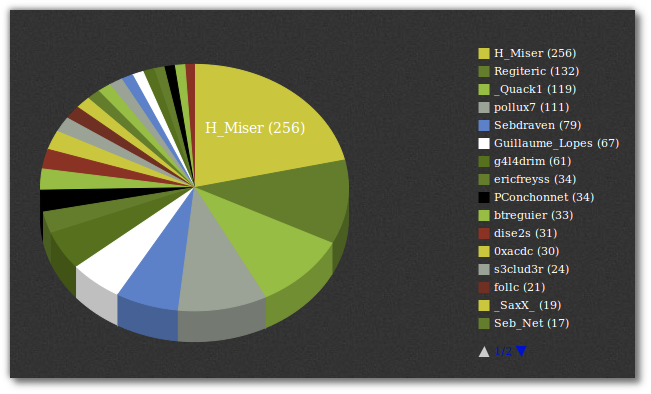
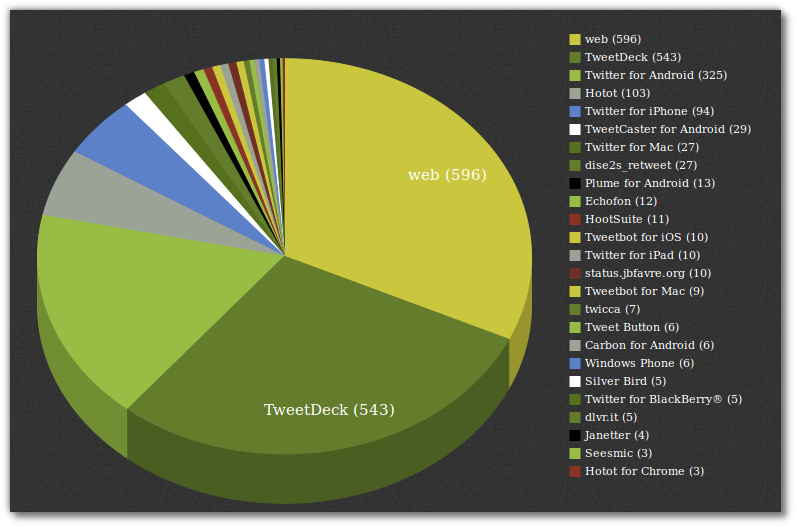
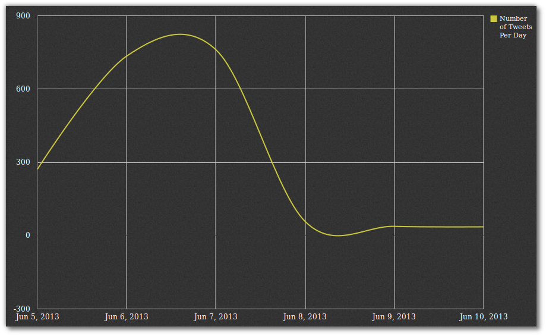

Title: SSTIC 2013 : The End
Date: 2013-06-08 20:00
Author: Quack1
Category: Securité
Slug: sstic_2013_end
Tags: SSTIC, SSTIC 2013, Sécurité, planet-libre, planet-ubuntu, Job, Stage
Summary:  SSTIC 2013 : The End
Lang: fr

Le [SSTIC 2013](/category/SSTIC.html) vient de se terminer, et j'ai déjà hâte à l'année prochaine pour pouvoir y retourner. Mais avant de penser à l'année prochaine faisons une petite rétrospective de cette année!

Avant tout, je veux quand même féliciter tous les orateurs, les organisateurs et les membres du comité de programme pour l'excellent niveau des conférences auxquelles j'ai pu assister. 

J'ai également eu l'occasion de rencontrer beaucoup de monde, certains que je connaissais AFK, d'autres que je ne connaissais que via [Twitter](https://twitter.com/_Quack1), et d'autres que je ne connaissais pas du tout. Je tiens donc à remercier, en vrac, pour les bons moments passés à discuter, @[follc](https://twitter.com/follc), @[Zythom](https://twitter.com/Zythom) (je vous conseille **très fortement** de lire [son blog](http://zythom.blogspot.com)), @[g4l4drim](https://twitter.com/g4l4drim), @[newsoft](https://twitter.com/newsoft), et beaucoup d'autres dont je n'ai pas les nicks Twitter.

Je ferais sûrement une prez avec un recap des conférences au boulot, si j'y pense je posterais le lien ici aussi!

Pour finir mon article, voilà les liens pour accéder à mes différents billets et quelques stats sur ce qui a été twitté la semaine dernière.

# Liens directs vers mes autres articles

- [Jour 0](/sstic_2013_0.html)
- [Jour 1](/sstic_2013_1.html)
- [Jour 2](/sstic_2013_2.html)
- [Jour 3](/sstic_2013_3.html)
- [Quelques blagues](/sstic_2013_vannes.html)
- [Slides](/sstic_2013_slides.html)

# SSTIC : May the Force be with Twitter

Sur les 3 jours du SSTIC, nous avons été entre 5 et 6 à live-tweeter intensément et régulièrement les conférences. La palme revenant à [Heat Miser](https://twitter.com/H_Miser) qui a sans aucun doute été celui qui a le mieux live-twitté les trois jours!

Quelques statistiques pour le hastag #SSTIC :

[Images les plus tweetées](http://www.tweetarchivist.com/8c7bb518/3/media)

&nbsp;

Sinon, voici un peu d'_attention-whorisme_ de ma part avec les stats sur mes tweets et mes tweets les plus RT/favorisés.

Sur les 3 jours, j'ai twitté plus de 130 tweets sur le hashtag [#SSTIC](https://twitter.com/search/realtime?q=%23sstic&src=typd). Ils sont répartis sur les 3 jours avec 56 le premier jour, 39 le deuxième et 35 le troisième.

Mes 3 tweets les plus RT/favorisés sont les suivants : 

<blockquote class="twitter-tweet" lang="fr">
La clé usb peut se faire passer pour un clavier et taper la ligne de commande qui lance l'exe vérolé qu'elle stocke <a href="https://twitter.com/search/%23SSTIC">#SSTIC</a>
&mdash; Qu@ck1 (@_Quack1) <a href="https://twitter.com/_Quack1/status/342282701774143490">5 juin 2013</a></blockquote>

<blockquote class="twitter-tweet" lang="fr">
"Quand on pourra surveiller ses surveillants, on sera vraiment libres" @<a href="https://twitter.com/laurentchemla">laurentchemla</a> <a href="https://twitter.com/search/%23SSTIC">#SSTIC</a>
&mdash; Qu@ck1 (@_Quack1) <a href="https://twitter.com/_Quack1/status/342584488167108609">6 juin 2013</a></blockquote>

<blockquote class="twitter-tweet" lang="fr">
Et il a aussi fait KECCAK, qui est devenu SHA-3 <a href="https://twitter.com/search/%23SSTIC">#SSTIC</a>. On a une star de la crypto dans la salle! <a href="https://twitter.com/search/%23SSTIC">#SSTIC</a>
&mdash; Qu@ck1 (@_Quack1) <a href="https://twitter.com/_Quack1/status/342197663405588480">5 juin 2013</a></blockquote>

<blockquote class="twitter-tweet" lang="fr">
Donc dans 1 fichier pdf, on peut mettre du code HTML, du Java (ZIP), du PE (exe) et le pdf complet <a href="https://twitter.com/search/%23SSTIC">#SSTIC</a>
&mdash; Qu@ck1 (@_Quack1) <a href="https://twitter.com/_Quack1/status/342222366488817665">5 juin 2013</a></blockquote>

<blockquote class="twitter-tweet" lang="fr">
"Attaque de la femme de ménage démoniaque" <a href="https://twitter.com/search/%23PointDSK">#PointDSK</a> <a href="https://twitter.com/search/%23SSTIC">#SSTIC</a>
&mdash; Qu@ck1 (@_Quack1) <a href="https://twitter.com/_Quack1/status/342990091679059968">7 juin 2013</a></blockquote>

