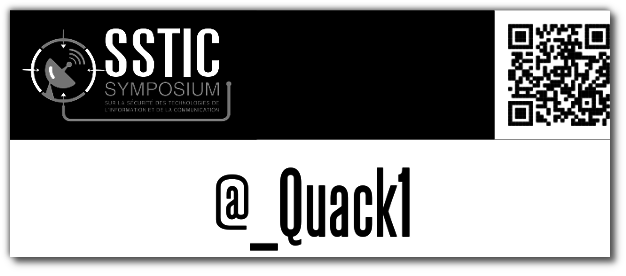

Title: &#35;SSTIC 2014 : Le retour
Date: 2014-06-02 21:00
Author: Quack1
Category: Securité
Slug: sstic_2014_0
Tags: SSTIC, SSTIC 2014, Sécurité, planet-libre, Job
Summary: Comme [l'année dernière]({filename}/sstic_2013_0.md), je serais présent les trois prochains jours au [#SSTIC](https://www.sstic.org)(Symposium sur le Sécurité des Technologies de l'Information et de la Communication) à Rennes !
Lang: fr

&nbsp;

Comme [l'année dernière]({filename}/sstic_2013_0.md), je serais présent les trois prochains jours au [#SSTIC](https://www.sstic.org) (Symposium sur le Sécurité des Technologies de l'Information et de la Communication) à Rennes !

J'essaierais de [live-tweeter](https://twitter.com/_Quack1) au maximum et de publier des articles récapitulatifs pour chacune des trois journées :)

# Liens directs

- [Jour 1]()
- [Jour 2]()
- [Jour 3]()
- [Article de fin]()

<!--
- [Jour 1](/sstic_2014_1.html)
- [Jour 2](/sstic_2014_2.html)
- [Jour 3](/sstic_2014_3.html)
- [Article de fin](/sstic_2014_fin.html)
- [Slides](/sstic_2014_slides.html)
-->

&nbsp;

_Pour les lecteurs du Planet-Libre, je rappelle que cet article et les suivants qui concerneront le [SSTIC](/tag/SSTIC.html) ne sont pas vraiment dans l'optique du libre, mais je pense qu'ils peuvent être intéressants pour avoir accès à un retour sur ce genre de manifestation._