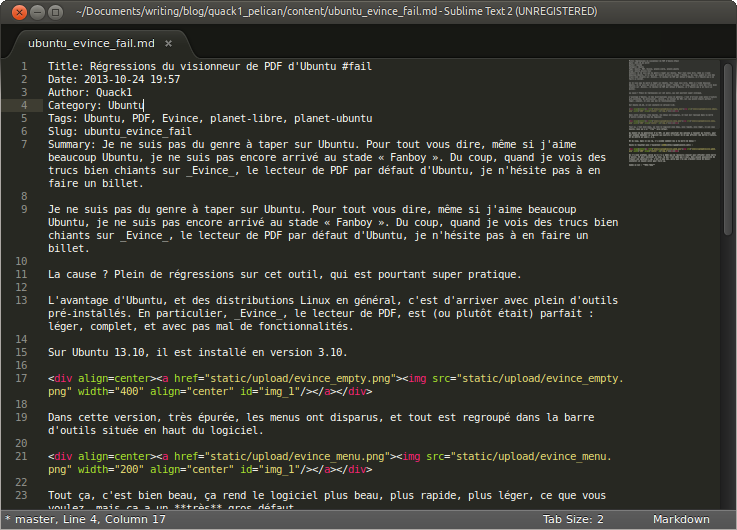
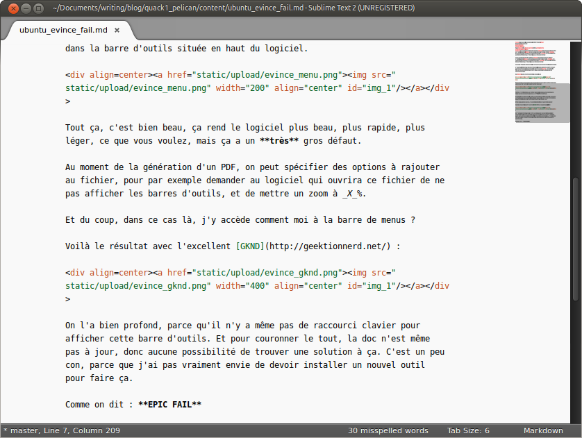

Title: Ma configuration Sublime-Text pour écrire en Markdown
Date: 2013-10-30 18:34 
Author: Quack1
Category: Writing
Tags: Écriture, Sublime Text, Markdown, planet-libre, planet-ubuntu
Slug: sublime_text_markdown
Summary: Sublime Text est un excellent éditeur de texte, qui a la base sert à taper du code. Sauf que quand on écrit en Markdown et qu'on veut utiliser toutes ses capacités, un éditeur dédié au code source n'est pas vraiment adapté. Mais il est possible de modifier un peu la configuration de Sublime Text pour avoir un environnement plus agréable pour l'écriture de texte.

Depuis un bon moment déjà j'écris tout en [Markdown](http://daringfireball.net/projects/markdown/ "Markdown Homepage"). Ce blog — et l'[autre](http://writing.quack1.me "Let's Write") —, mes notes (avec [RedNotebook](http://rednotebook.sourceforge.net/index.html "RedNotebook") entre autres), et encore plein d'autres choses de cette façon. Seul le boulot et sa suite Office me résistent encore 😋 !

Pour écrire tout ça j'utilise [Sublime Text](http://www.sublimetext.com/ "Sublime Text"), qui est un excellent éditeur de texte. Véritable [IDE](https://fr.wikipedia.org/wiki/Environnement_de_d%C3%A9veloppement_int%C3%A9gr%C3%A9 "Environnement de développement"), il est à la base dédié à l'édition de [code source](https://fr.wikipedia.org/wiki/Code_source "Code source").

Du coup, quand on veut écrire du texte dedans, c'est pas super agréable...

L'avantage de Sublime-Text, c'est que chaque utilisateur peut redéfinir des préférences, qui surchargent celles par défaut. Et cerise sur le gâteau, on peut redéfinir des préférences pour chaque extension de fichiers! Et c'est justement cette fonctionnalité qui m'intéresse.

Maintenant, quand j'écris du Markdown, ça ressemble à ça : 

Pour modifier la configuration de Sublime Text, ouvrez un fichier Markdown (chez moi avec l'extension `.md`), et allez dans `Préférences` ➜ `Settings - More` ➜ `Syntax Specific - User`.

Mon fichier de configuration ressemble à ça : 

	:::json
	{
		"extensions":
		[
			"md"
		],
		"auto_complete": true,
		"spell_check": true,
		"dictionary": "Packages/Language - French - Français/fr_FR (all variants).dic",
		"draw_centered": true,
		"word_wrap": "True",
		"wrap_width": 80,
		"font_size": 9,
		"gutter": false,
		"line_numbers": false,
		"line_padding_bottom": 2,
		"line_padding_top": 2,
		"scroll_past_end": true,
		"tab_size": 6
	}

Ligne par ligne, qu'est ce que ça fait : 

- `"extensions"` désigne les extensions pour lesquelles ce fichier s'applique ;
- `"auto_complete"` active la complétion automatique avec `<TAB>` ;
- `"spell_check"` active la vérification orthographique ;
- `"dictionary"` pointe sur le dictionnaire à utiliser pour la vérification orthographique (les dictionnaires proviennent de [Libre Office](http://www.sublimetext.com/docs/2/spell_checking.html "Sublime Text 2 Documentation - Spell Checking")) ;
- `"draw_centered"` centre le texte dans la fenêtre ;
- `"word_wrap"` coupe les lignes lors de l'affichage après X caractères ;
- `"wrap_width"` désigne le nombre de caractères avant de couper la ligne ;
- `"font_size"` défini la taille de la police de caractères ;
- `"gutter"` je ne sais pas ce que ça fait, mais c'est défini à `false` dans le mode _Distraction Free_, donc je pense que ce n'est pas mauvais... ;
- `"line_numbers"` désactive l'affichage du nombre de lignes, mais je songe à le réactiver... ;
- `"line_padding_bottom"`et `"line_padding_top"` ajoutent de l'espacement au-dessous et au-dessus des lignes de texte, pour l'aérer ;
- `"scroll_past_end"` permet de faire défiler le texte même quand on arrive à la fin du fichier ;
- `"tab_size"` augmente le nombre d'espaces à utiliser pour les tabulations (en réalité Sublime Text utilise bien le caractère `<TAB>`, mais cette tabulation est affichée pour quelle corresponde à 6 espaces).

Plus d'options sont disponibles dans [la doc de Sublime Text](http://www.sublimetext.com/docs/2/ "Sublime Text 2 Documentation"). Je ne pense pas avoir pensé à tout, si vous trouvez comment améliorer encore cette configuration, n'hésitez pas!