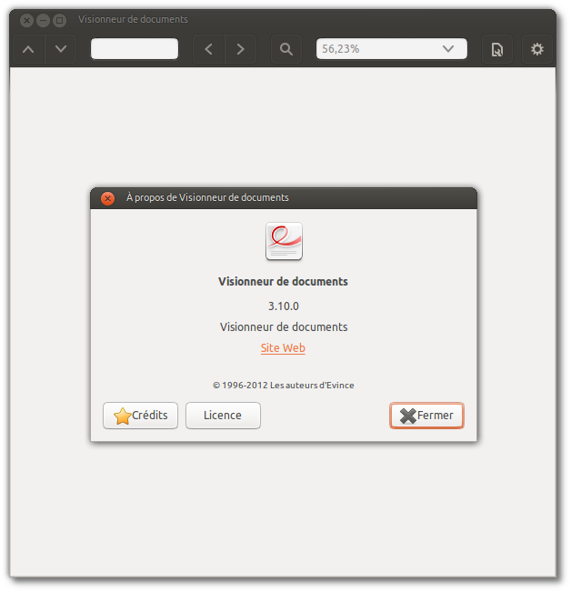
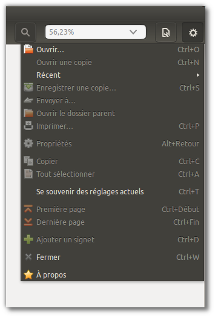
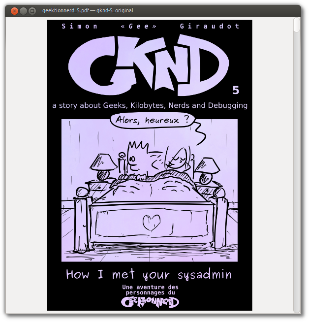

Title: Régressions du visionneur de PDF d'Ubuntu #fail
Date: 2013-10-24 19:57
Author: Quack1
Category: Ubuntu
Tags: Ubuntu, PDF, Evince, planet-libre, planet-ubuntu
Slug: ubuntu_evince_fail
Summary: Je ne suis pas du genre à taper sur Ubuntu. Pour tout vous dire, même si j'aime beaucoup Ubuntu, je ne suis pas encore arrivé au stade « Fanboy ». Du coup, quand je vois des trucs bien chiants sur _Evince_, le lecteur de PDF par défaut d'Ubuntu, je n'hésite pas à en faire un billet.

Je ne suis pas du genre à taper sur Ubuntu. Pour tout vous dire, même si j'aime beaucoup Ubuntu, je ne suis pas encore arrivé au stade « Fanboy ». Du coup, quand je vois des trucs bien chiants sur _Evince_, le lecteur de PDF par défaut d'Ubuntu, je n'hésite pas à en faire un billet.

La cause ? Plein de régressions sur cet outil, qui est pourtant super pratique.

L'avantage d'Ubuntu, et des distributions Linux en général, c'est d'arriver avec plein d'outils pré-installés. En particulier, _Evince_, le lecteur de PDF, est (ou plutôt était) parfait : léger, complet, et avec pas mal de fonctionnalités.

Sur Ubuntu 13.10, il est installé en version 3.10.

Dans cette version, très épurée, les menus ont disparus, et tout est regroupé dans la barre d'outils située en haut du logiciel.

Tout ça, c'est bien beau, ça rend le logiciel plus beau, plus rapide, plus léger, ce que vous voulez, mais ça a un **très** gros défaut.

Au moment de la génération d'un PDF, on peut spécifier des options à rajouter au fichier, pour par exemple demander au logiciel qui ouvrira ce fichier de ne pas afficher les barres d'outils, et de mettre un zoom à _X_%.

Et du coup, dans ce cas là, j'y accède comment moi à la barre de menus ?

Voilà le résultat avec l'excellent [GKND](http://geektionnerd.net/) : 

On l'a bien profond, parce qu'il n'y a même pas de raccourci clavier pour afficher cette barre d'outils. Et pour couronner le tout, la doc n'est même pas à jour, donc aucune possibilité de trouver une solution à ça. C'est un peu con, parce que j'ai pas vraiment envie de devoir installer un nouvel outil pour faire ça.

Comme on dit : **EPIC FAIL**