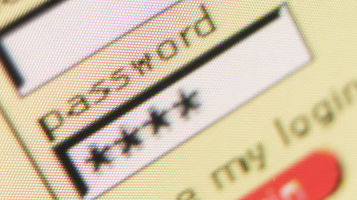
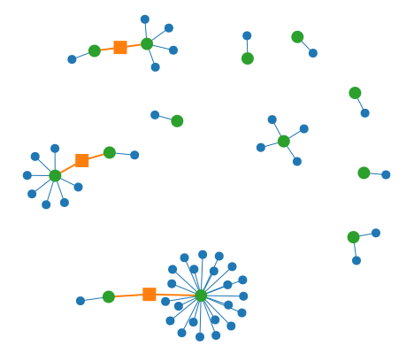

Title: Vérifier la sécurité de vos mots de passe
Date: 2012-02-15 23:56
Author: Quack1
Category: Securité
Tags: firefox, mot de passe, Password Reuse Visualizer, passwordmeter

Ce soir, deux petits liens pour tester la sécurité de vos mots de passe,
pierre angulaire de toute la sécurité en informatique.

[PasswordMeter][]
-----------------

Le premier [lien][PasswordMeter] est un site qui évalue la qualité de
votre mot de passe suivant plusieurs critères, comme sa longueur, la
présence de chiffres, majuscules, symboles, les suites de caractères,
les suites de chiffres, etc...

La sécurité du mot de passe est donné sous la forme d'un pourcentage de
sécurisation. Attention, ce n'est pas parce que vous avez obtenu 100%
que votre mot de passe ne pourra pas être cassé, cela signifie qu'il y a
potentiellement moins de chances pour qu'il puisse être trouvé...

[Password Reuse Visualizer][]
-----------------------------

Ce second [lien][Password Reuse Visualizer] est une add-on qui analyse
tous les mots de passe enregistrés dans Firefox. Il est recommandé de ne
pas utiliser le même mot de passe sur plusieurs sites, afin de limiter
les risques.

C'est là tout le travail de ce plugin. Il analyse tous les mots de passe
que vous avez stocké dans Firefox, puis produit une carte comme celle-ci
dessous avec le résultat. Chaque point vert représente un mot de passe,
les points bleus sont les sites web qui utilisent les dits-mots de
passe. Des liaisons orange existent entre deux mots de passe quand ils
sont très similaires.

 

En théorie, il faudrait avoir un seul point bleu relié à chaque point
vert. En pratique, c'est souvent compliqué de se souvenir de plusieurs
dizaines, voire de plusieurs centaines de mots de passe. Évitez au moins
de ne pas utiliser le même mot de passe sur le site de votre banque et
sur des sites sur lesquels vous partagez des fichiers avec vos amis....

Pour installer l'add-on, cliquez sur le lien plus haut, puis sur *Add to
Firefox*. Une fois l'installation terminée, un petit cadenas bleu sera
apparu en bas à droite de Firefox. Cliquez une fois dessus, et votre
*Password-Map* apparaîtra comme par magie :-)

[Source][]

  [PasswordMeter]: http://www.passwordmeter.com/ "PasswordMeter"
  [Password Reuse Visualizer]: https://addons.mozilla.org/en-US/firefox/addon/password-reuse-visualizer/ "Password Reuse Visualizer"
  [Image Firefox Password Reuze Visualizer]: https://static.crazyws.fr/resources/blog/2012/02/firefox-extension-password-reuse-visualizer.png "Firefox Password Reuze Visualizer"
  [Source]: http://www.crazyws.fr/mozilla/une-extension-qui-illustre-la-reutilisation-de-mots-de-passe-UNGW3.html "Crazy WS - Reutilisation des mots de passe"
