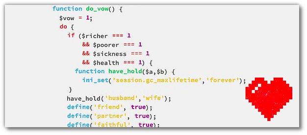

Title: celebrate_wedding(wed1, wed2);
Date: 2013-07-03 13:10
Author: Quack1
Category: Geek
Slug: wedding_code
Tags: planet-libre, Mariage, Php, Dev
Summary: Et si un jour l'intelligence artificielle des robots devenait assez performante pour qu'ils soient capable de tomber amoureux et de se marier ? Et bien il existe déjà une fonction Php pour ça, qui permet d'effectuer un mariage directement dans du code!
Lang: fr

&nbsp;

Vous voulez célébrer un mariage dans un programme ? Et bien le code source suivant est fait pour vous. En effet, il reprend toutes les étapes des mariages traditionnels sous la forme d'un code PHP.

Au programme, les voeux des époux, l'échange des alliances, et tout ce qui va bien! Et pour couronner le tout, le code est \#mariagePourTous-compliant, il se fiche du sexe des mariés! ;)

	:::php
	<?
	function do_wed(){
		if ($objections != true){
			function do_vow(){
				$vow = 1;
				do{
					if ($richer === 1
							&& $poorer === 1
							&& $sickness === 1
							&& $health === 1) {
						function have_hold($a, $b){
							ini_set('session.gc_maxlifetime','forever');
						}
						have_hold('husband','wife');
						define('friend', true);
						define('partner'true);
						define('faithful',true);
						if($i = 'do') {
							$f = 'finger';
							$r = 'ring';
							$f = $f + $r;
						}
					}
					$vow = $vow + 1;
				} while ($vow != 2);
			}
			do_vow();
			$register = array_fill($details);
			print_r($register);
			return $kiss
		}
	}
	do_wed();
	?>

via [Geeks Are Sexy](http://www.geeksaresexy.net/2013/07/01/the-nerd-wedding-code-pic)

_Le sieur [Zythom](http://zythom.blogspot.fr/) fête aujourd'hui [ses 20 ans de mariage](https://twitter.com/Zythom/status/352330490390392832). Coïncidence, je publie ce post aujourd'hui. Petite dédicace donc à lui et son épouse, accompagnée de tous mes voeux! :)_