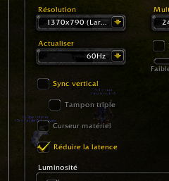

Title: World of Warcraft sur Linux
Date: 2011-11-25 17:46
Author: Quack1
Category: Ubuntu
Tags: Ubuntu, World of Warcraft, Wine, planet-libre, planet-ubuntu
Summary: Configuration permettant d'améliorer World of Warcraft sur GNU/Linux.

Certains d'entre vous jouent peut être à World Of Warcraft sur Linux en utilisant wine.Pour ceux qui souhaiteraient le faire, il y a un très bon tutoriel dédié dans la [doc d'Ubuntu][].

Personnellement, la chose m'avait un peu rebutée à cause d'un nombre d'images par secondes (*ips* ou *fps*(en anglais)).

J'ai découvert hier matin une petite astuce pour l'augmenter considérablement.

Il suffit de cocher l'option "Réduire la latence" dans les options vidéo de World of Warcraft :

Bon, évidemment, l'image est un peu plus moche qu'avant, mais ça n'empêche absolument pas de jouer :P Et ça nous évite de devoir rebooter sur Windows pour pouvoir geeker entre 2 lignes de codes!!
 
J'espère que ça marchera aussi chez vous, mais il n'y a pas de raisons ;)

  [doc d'Ubuntu]: http://doc.ubuntu-fr.org/wow "doc d'Ubuntu sur Wine et World of Warcraft"
