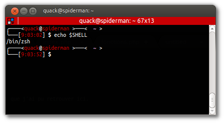

Title: Migration de Bash à zsh
Date: 2013-05-16 09:37
Author: Quack1
Category: Linux
Slug: zsh_intro
Tags: Bash, Zsh, Ubuntu, planet-libre, planet-ubuntu
Summary: Migrer son shell de Bash à zsh. Avantages et attraits de zsh sur Bash.

Depuis quelques temps, je vois de plus en plus de personnes utilisant zsh comme shell par défaut en lieu et place de Bash. J'ai dont été tenté moi aussi d'essayer zsh.

Ce qui m'a fait sauter le pas en début de semaine, ce fût cette présentation disponible sur [Slideshare](http://www.slideshare.net/jaguardesignstudio/why-zsh-is-cooler-than-your-shell-16194692 "Why zsh is cooler than your shell") et partagée sur Twitter par [@UnixToolTip](https://twitter.com/UnixToolTip/status/333313161925120000) : 

<iframe src="http://www.slideshare.net/slideshow/embed_code/16194692" width="427" height="356" frameborder="0" marginwidth="0" marginheight="0" scrolling="no" style="border:1px solid #CCC;border-width:1px 1px 0;margin-bottom:5px" allowfullscreen webkitallowfullscreen mozallowfullscreen> </iframe> 
 <strong> <a href="http://www.slideshare.net/jaguardesignstudio/why-zsh-is-cooler-than-your-shell-16194692" title="Why Zsh is Cooler than Your Shell" target="_blank">Why Zsh is Cooler than Your Shell</a> </strong> from <strong><a href="http://www.slideshare.net/jaguardesignstudio" target="_blank">jaguardesignstudio</a></strong> 

[Lien de téléchargement de la présentation](/upload/zsh.pdf). Attention, SlideShare fournit un pdf un peu pouri et quasiment inutilisable.. :/

Les points qui m'ont vraiment attiré sont : 

- Rétro compatibilité avec Bash
- Lors de l'auto-complétion, affichage des choix possibles avec seulement 1 TAB (au lieu de 2 avec Bash)
- L'auto-complétion des options de nombreux outils, donc Git, Make, etc... Par exemple, avec Git, lors d'un `git add`, zsh va ne lister avec TAB que les fichiers modifiés depuis le dernier commit, ce qui est très pratique.	
- Un historique des commandes lancées en temps-réel. Si vous avez plusieurs shells ouverts, une commande lancée dans l'un sera accessible dans l'historique (en remontant avec la flèche haut ou par une recherche Ctrl-R) dans l'autre directement sans avoir à rouvrir le shell.
- Une gestion des séparateurs améliorée par rapport à Bash. 

Je m'explique sur ce dernier point. Quand, dans Bash, on fait un ^W pour supprimer le dernier "mot" tapé, Bash supprime tout jusqu'au prochain espace. Exemple : 
	
	:::bash
	quack@spiderman $ cd /home/quack/work^W
	quack@spiderman $ cd 

Au contraire, zsh gère les séparateurs tels que le slash dans ^W, et supprimera tout jusqu'au prochain mot "réel" : 
	
	:::zsh
	╭────<quack@spiderman >───<  ~ >  
	╰───[8:53:11] $ cd /home/quack/work^W
	╭────<quack@spiderman >───<  ~ >  
	╰───[8:53:11] $ cd /home/quack/

C'est une fonctionnalité que j'attendais et que j'ai pu retrouver ici.

&nbsp;

Il y a sûrement d'autres choses très bien dans zsh, mais toutes ne m'ont pas forcément parues exceptionnelles tout simplement parce que je ne vais pas les utiliser souvent. 

Un dernier avantage est la communauté qu'il y a derrière, et surtout derrière [oh-my-zsh](https://github.com/robbyrussell/oh-my-zsh "Github Oh-my-zsh"), qui maintient une base de fichiers de configuration pour zsh, qui permet d'obtenir un super shell sans avoir à se plonger dans les méandres de la documentation à peine zsh installé. J'ai pu ainsi retrouver un shell identique à [celui que je m'étais fait sur Bash](|filename|/customisation-de-mon-bashrc.md) simplement en modifiant un thème présent dans oh-my-zsh.

# Si vous voulez essayer zsh

Pour l'installer sur votre système (chez moi Ubuntu) un simple `apt-get install zsh` suffit. On change ensuite son shell par défaut pour utiliser zsh : 

	:::bash
	quack@spiderman $ chsh
	Mot de passe : 
	Changement d'interpréteur de commandes initial pour quack
	Entrez la nouvelle valeur ou « Entrée » pour conserver la valeur proposée
		Interpréteur de commandes initial [/bin/bash]: /bin/zsh
	quack@spiderman $ $ 

Et après une déconnexion/reconnexion, on se retrouve avec un "beau" shell zsh : 

	:::zsh
	spiderman% 

Et voilà!

Retrouvez également le bon article de [Julien](https://twitter.com/JulienHOMMET) sur [son blog](http://idealogeek.fr/2013/zsh/), où il explique plus en détail que moi l'installation et les premières étape de configuration!